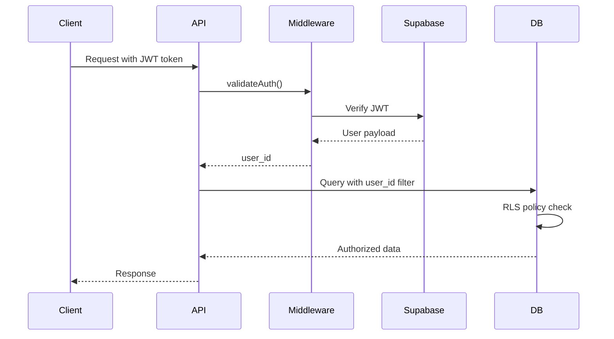

# Backend Architecture

This section defines backend-specific architecture including serverless function organization, database access patterns, and authentication implementation.

## Service Architecture - Serverless Functions

**Next.js API Routes Organization:**

```
apps/web/app/api/
├── cards/
│   ├── route.ts                 # GET /api/cards (list all)
│   ├── [slug]/
│   │   └── route.ts            # GET /api/cards/:slug
│   └── shuffle/
│       └── route.ts            # GET /api/cards/shuffle
├── readings/
│   ├── route.ts                 # POST /api/readings, GET /api/readings
│   └── [id]/
│       └── route.ts            # GET/PATCH/DELETE /api/readings/:id
├── users/
│   ├── me/
│   │   ├── route.ts            # GET/PATCH /api/users/me
│   │   └── stats/route.ts      # GET /api/users/me/stats
│   └── preferences/
│       └── route.ts            # GET/PATCH /api/preferences
├── favorites/
│   ├── route.ts                 # GET/POST /api/favorites
│   └── [id]/route.ts           # DELETE /api/favorites/:id
├── share/
│   └── generate/route.ts        # POST /api/share/generate
└── middleware/
    ├── auth.ts                  # JWT validation
    ├── error.ts                 # Error handling
    └── logger.ts                # Request logging
```

**Function Template:**

```typescript
// app/api/readings/route.ts
import { NextRequest, NextResponse } from 'next/server';
import { validateAuth } from '../middleware/auth';
import { handleApiError } from '../middleware/error';
import { createReadingService } from '@/services/readings';
import { CreateReadingSchema } from '@/lib/validation';

// POST /api/readings - Create new reading
export async function POST(request: NextRequest) {
  try {
    // Optional auth (anonymous allowed)
    const user = await validateAuth(request, { required: false });
    
    // Parse and validate request body
    const body = await request.json();
    const data = CreateReadingSchema.parse(body);
    
    // Create reading
    const reading = await createReadingService({
      ...data,
      user_id: user?.id || null,
    });
    
    return NextResponse.json(
      { reading, message: 'Reading created successfully' },
      { status: 201 }
    );
  } catch (error) {
    return handleApiError(error);
  }
}

// GET /api/readings - Get reading history
export async function GET(request: NextRequest) {
  try {
    // Required auth
    const user = await validateAuth(request, { required: true });
    
    // Parse query params
    const { searchParams } = new URL(request.url);
    const limit = parseInt(searchParams.get('limit') || '20');
    const offset = parseInt(searchParams.get('offset') || '0');
    
    // Get readings
    const { readings, total } = await getReadingsService(user.id, { limit, offset });
    
    return NextResponse.json({ readings, total, limit, offset });
  } catch (error) {
    return handleApiError(error);
  }
}
```

## Database Architecture - Repository Pattern

**Data Access Layer:**

```typescript
// services/repositories/readingRepository.ts
import { prisma } from '@/lib/prisma';
import { Reading, Prisma } from '@prisma/client';

export class ReadingRepository {
  async create(data: Prisma.ReadingCreateInput): Promise<Reading> {
    return prisma.reading.create({
      data,
      include: {
        reading_cards: {
          include: {
            card: true,
          },
        },
      },
    });
  }

  async findByUserId(
    userId: string,
    options: { limit: number; offset: number }
  ) {
    const [readings, total] = await Promise.all([
      prisma.reading.findMany({
        where: { user_id: userId },
        include: {
          reading_cards: {
            include: { card: true },
          },
        },
        orderBy: { created_at: 'desc' },
        take: options.limit,
        skip: options.offset,
      }),
      prisma.reading.count({
        where: { user_id: userId },
      }),
    ]);

    return { readings, total };
  }

  async findById(id: string): Promise<Reading | null> {
    return prisma.reading.findUnique({
      where: { id },
      include: {
        reading_cards: {
          include: { card: true },
          orderBy: { position: 'asc' },
        },
      },
    });
  }

  async update(id: string, data: Prisma.ReadingUpdateInput): Promise<Reading> {
    return prisma.reading.update({
      where: { id },
      data,
    });
  }

  async delete(id: string): Promise<void> {
    await prisma.reading.delete({
      where: { id },
    });
  }
}
```

**Service Layer:**

```typescript
// services/readings/createReading.ts
import { ReadingRepository } from '../repositories/readingRepository';
import { ShuffleEngine } from '../shuffle/engine';
import { prisma } from '@/lib/prisma';

interface CreateReadingData {
  user_id: string | null;
  reading_type: 'daily' | 'three_card';
  question?: string;
}

export async function createReadingService(data: CreateReadingData) {
  const repo = new ReadingRepository();
  const shuffle = new ShuffleEngine();

  // Draw cards
  const count = data.reading_type === 'daily' ? 1 : 3;
  const drawnCards = shuffle.drawCards(count);

  // Create reading with cards in transaction
  return prisma.$transaction(async (tx) => {
    // Create reading
    const reading = await tx.reading.create({
      data: {
        user_id: data.user_id,
        reading_type: data.reading_type,
        question: data.question,
      },
    });

    // Create reading cards
    const readingCards = drawnCards.map((card, index) => ({
      reading_id: reading.id,
      card_id: card.cardId,
      position: index,
      position_label: data.reading_type === 'three_card' 
        ? (['past', 'present', 'future'][index] as any)
        : null,
      is_reversed: card.isReversed,
    }));

    await tx.readingCard.createMany({
      data: readingCards,
    });

    // Fetch complete reading with cards
    return tx.reading.findUnique({
      where: { id: reading.id },
      include: {
        reading_cards: {
          include: { card: true },
          orderBy: { position: 'asc' },
        },
      },
    });
  });
}
```

## Authentication Architecture

**Middleware Implementation:**

```typescript
// app/api/middleware/auth.ts
import { NextRequest } from 'next/server';
import { createServerClient } from '@supabase/ssr';
import { cookies } from 'next/headers';

export async function validateAuth(
  request: NextRequest,
  options: { required: boolean } = { required: true }
) {
  const cookieStore = cookies();
  
  const supabase = createServerClient(
    process.env.NEXT_PUBLIC_SUPABASE_URL!,
    process.env.NEXT_PUBLIC_SUPABASE_ANON_KEY!,
    {
      cookies: {
        get(name: string) {
          return cookieStore.get(name)?.value;
        },
      },
    }
  );

  // Get user from JWT
  const { data: { user }, error } = await supabase.auth.getUser();

  if (error || !user) {
    if (options.required) {
      throw new Error('Authentication required');
    }
    return null;
  }

  return user;
}
```

**Auth Flow Diagram:**



---
