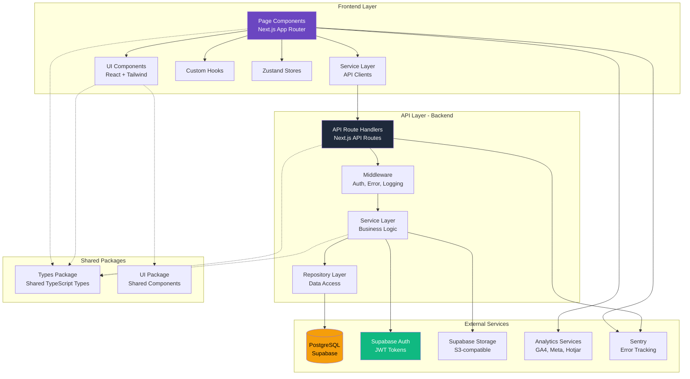
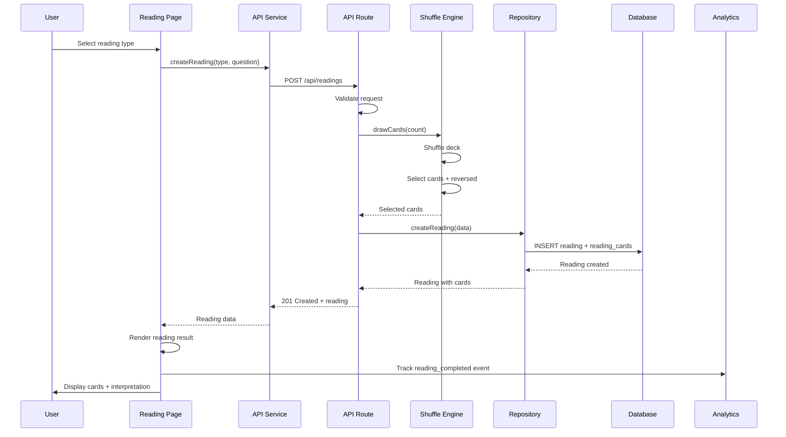
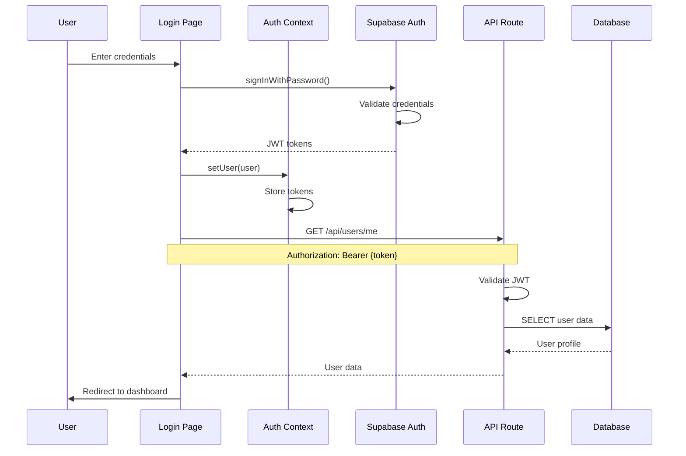

# Components

This section identifies major logical components across the fullstack application. Components are organized by layer (Frontend, Backend, Shared) with clear boundaries, responsibilities, and interfaces.

## Frontend - Web Application (`apps/web/`)

**Responsibility:** React-based user interface for tarot reading application. Handles all user interactions, displays readings, manages client-side state, and communicates with backend APIs.

**Key Interfaces:**
- **Public Pages:** Landing page, reading selection, card selection, reading results, card encyclopedia
- **Authenticated Pages:** User profile, reading history, favorites, preferences
- **API Communication:** RESTful API calls via service layer to Next.js API Routes

**Dependencies:**
- Next.js 14+ framework (routing, SSR, image optimization)
- Supabase client (authentication state management)
- Shared packages (types, constants, utilities)
- External libraries (Tailwind, Framer Motion, React Hook Form)

**Technology Stack:**
- **Framework:** Next.js 14+ App Router
- **Language:** TypeScript 5.3+
- **Styling:** Tailwind CSS + Framer Motion
- **State:** Zustand (UI state) + React Context (auth state)
- **Forms:** React Hook Form + Zod validation

**Sub-components:**
- Page Components (app router structure)
- UI Components (reusable React components)
- Layout Components (navigation, footer, modals)
- Feature Components (card selection, reading display)
- Service Layer (API client abstractions)
- Hooks (custom React hooks for shared logic)
- Stores (Zustand state management)

---

## Backend - API Layer (`apps/web/app/api/`)

**Responsibility:** Serverless API endpoints that handle business logic, database operations, authentication, and external service integrations. Deployed as Vercel serverless functions.

**Key Interfaces:**
- **REST API Endpoints:** `/api/cards`, `/api/readings`, `/api/users`, `/api/favorites`, `/api/preferences`, `/api/share`
- **Database Access:** Prisma ORM to PostgreSQL (Supabase)
- **Authentication:** Supabase Auth JWT validation
- **File Storage:** Supabase Storage for images

**Dependencies:**
- Prisma Client (database access)
- Supabase Server Client (auth validation, storage)
- Shared packages (types, utilities, validators)
- Node.js runtime (Vercel serverless)

**Technology Stack:**
- **Runtime:** Node.js on Vercel Serverless Functions
- **Language:** TypeScript 5.3+
- **ORM:** Prisma 5.8+
- **Validation:** Zod schemas
- **Auth:** Supabase Auth (JWT validation)

**Sub-components:**
- API Route Handlers (Next.js route handlers)
- Service Layer (business logic)
- Repository Layer (data access abstraction)
- Middleware (authentication, error handling, logging)
- Validators (request/response validation)

---

## Database Layer (Supabase PostgreSQL)

**Responsibility:** Persistent data storage for users, cards, readings, favorites, and preferences. Enforces data integrity through constraints and Row Level Security (RLS) policies.

**Key Interfaces:**
- **Prisma Client:** Type-safe database queries
- **Connection Pooling:** Supabase's built-in pooling (PgBouncer)
- **RLS Policies:** User-scoped data access control

**Dependencies:**
- PostgreSQL 15+ (Supabase managed)
- Prisma migrations (schema versioning)

**Technology Stack:**
- **Database:** PostgreSQL 15+
- **Access:** Prisma ORM
- **Security:** Row Level Security (RLS)
- **Backup:** Supabase automatic daily backups

**Sub-components:**
- Tables (Users, Cards, Readings, ReadingCards, FavoriteCards, UserPreferences)
- Indexes (query optimization)
- RLS Policies (authorization)
- Triggers (future: audit logs, updated_at timestamps)

---

## Authentication Service (Supabase Auth)

**Responsibility:** User authentication and authorization. Handles signup, login, password reset, OAuth providers (Google, Facebook), JWT token issuance and validation.

**Key Interfaces:**
- **Frontend SDK:** Supabase JavaScript client (`@supabase/supabase-js`)
- **Backend Validation:** JWT verification in API routes
- **OAuth Providers:** Google, Facebook OAuth flows

**Dependencies:**
- Supabase Auth service (managed)
- User table (linked via user_id)

**Technology Stack:**
- **Provider:** Supabase Auth
- **Token Format:** JWT (JSON Web Tokens)
- **Session Storage:** httpOnly cookies or localStorage
- **OAuth:** Google and Facebook providers

**Sub-components:**
- Auth UI Components (signup, login, password reset forms)
- Auth Context (React Context for auth state)
- Protected Route Wrapper (HOC for authenticated pages)
- API Auth Middleware (JWT validation middleware)

---

## Storage Service (Supabase Storage)

**Responsibility:** Object storage for card images, user profile pictures, and generated share images. Provides CDN-backed URLs and access control via RLS.

**Key Interfaces:**
- **Upload API:** `supabase.storage.from('bucket').upload()`
- **Public URLs:** CDN-backed URLs for card images
- **Signed URLs:** Temporary URLs for private content

**Dependencies:**
- Supabase Storage (S3-compatible)
- RLS policies (access control)

**Technology Stack:**
- **Provider:** Supabase Storage
- **CDN:** Supabase CDN (CloudFlare)
- **Format:** WebP images (optimized)
- **Buckets:** `cards` (public), `profiles` (private), `shares` (public, temp)

**Sub-components:**
- Upload utilities (file size limits, format validation)
- Image optimization pipeline (WebP conversion, resizing)
- CDN cache management

---

## Card Shuffle Engine

**Responsibility:** Cryptographically secure random card selection. Ensures fair, unpredictable card draws and determines reversed status for each card.

**Key Interfaces:**
- **shuffle():** Returns randomized array of all 78 card IDs
- **drawCards(count):** Selects specified number of unique cards
- **determineReversed():** 50% chance for each card to be reversed

**Dependencies:**
- Crypto library (Node.js `crypto` module for secure randomization)
- Card data (list of all 78 card IDs)

**Technology Stack:**
- **Language:** TypeScript
- **Randomization:** `crypto.randomInt()` (cryptographically secure)
- **Algorithm:** Fisher-Yates shuffle

**Sub-components:**
- Shuffle algorithm implementation
- Reversed status generator
- Unit tests (verify randomness distribution)

---

## Share Image Generator

**Responsibility:** Generates beautiful social media share images (1080x1080 for Instagram, 1200x630 for Facebook/Twitter) with card images, interpretations, and branding.

**Key Interfaces:**
- **generateShareImage(readingId, format):** Returns URL to generated image
- **Supported formats:** Instagram (square), Facebook/Twitter (landscape)

**Dependencies:**
- Canvas library (`@vercel/og` or `canvas` for Node.js)
- Card images from Supabase Storage
- Font files for Thai language support

**Technology Stack:**
- **Library:** `@vercel/og` (Vercel Edge Function image generation)
- **Format:** PNG or JPEG
- **Storage:** Supabase Storage (temporary, 7-day expiration)

**Sub-components:**
- Template renderer (card layout, text positioning)
- Font loader (Thai + English fonts)
- Image compositor (combines elements)
- Storage uploader (saves to Supabase, returns URL)

---

## Analytics Tracker

**Responsibility:** Client-side analytics tracking for user behavior, conversion events, and performance metrics. Integrates with multiple analytics platforms.

**Key Interfaces:**
- **trackEvent(eventName, properties):** Send custom event
- **trackPageView(pagePath):** Page view tracking
- **identifyUser(userId):** Associate events with user

**Dependencies:**
- Google Analytics 4 (`gtag.js`)
- Meta Pixel
- Hotjar
- Vercel Analytics (automatic)

**Technology Stack:**
- **Providers:** GA4, Meta Pixel, Hotjar, Vercel Analytics
- **Implementation:** Client-side JavaScript (loaded asynchronously)
- **Privacy:** PDPA-compliant (cookie consent)

**Sub-components:**
- Analytics wrapper (unified interface for all providers)
- Event tracking hooks (`useTrackEvent`, `usePageView`)
- Cookie consent manager
- Environment-based enablement (disabled in development)

---

## Error Tracking Service (Sentry)

**Responsibility:** Captures and reports errors from both frontend and backend. Provides context (user actions, breadcrumbs) for debugging.

**Key Interfaces:**
- **captureException(error, context):** Log exception with context
- **captureMessage(message, level):** Log custom message
- **setUser(user):** Associate errors with user ID

**Dependencies:**
- Sentry SDK (`@sentry/nextjs`)
- Source maps (for stack trace symbolication)

**Technology Stack:**
- **Provider:** Sentry
- **SDK:** `@sentry/nextjs` (supports both client and server)
- **Integration:** Automatic Next.js error capture

**Sub-components:**
- Error boundary (React error boundary component)
- API error middleware (catches unhandled errors)
- Custom error reporter (business logic errors)

---

## Shared - Types Package (`packages/shared/`)

**Responsibility:** Shared TypeScript types, interfaces, and constants used across frontend and backend. Single source of truth for data contracts.

**Key Interfaces:**
- Exported types for all data models (User, Card, Reading, etc.)
- API request/response types
- Enums (ReadingType, Suit, Arcana, Theme, etc.)
- Constants (API endpoints, validation rules)

**Dependencies:**
- None (pure TypeScript types)

**Technology Stack:**
- **Language:** TypeScript 5.3+
- **Distribution:** Compiled to `dist/` for import

**Sub-components:**
- `/types/` - Interface definitions
- `/constants/` - Shared constants
- `/validators/` - Zod schemas (shared validation)
- `/utils/` - Pure utility functions

---

## Shared - UI Package (`packages/ui/`)

**Responsibility:** Reusable UI components that can be shared across multiple apps (future-proofing for admin dashboard or mobile web views).

**Key Interfaces:**
- Base components (Button, Input, Card, Modal)
- Accessibility components (VisuallyHidden, FocusTrap)
- Tailwind-based styling

**Dependencies:**
- React
- Tailwind CSS (via config package)
- Headless UI (accessible primitives)

**Technology Stack:**
- **Framework:** React + TypeScript
- **Styling:** Tailwind CSS
- **Documentation:** Storybook (future)

**Sub-components:**
- `/components/` - React components
- `/hooks/` - Shared React hooks
- `/styles/` - Shared CSS/Tailwind utilities

---

## Component Diagrams

### High-Level Component Architecture

### Component Interaction - Create Reading Flow

### Component Interaction - User Authentication Flow

---
