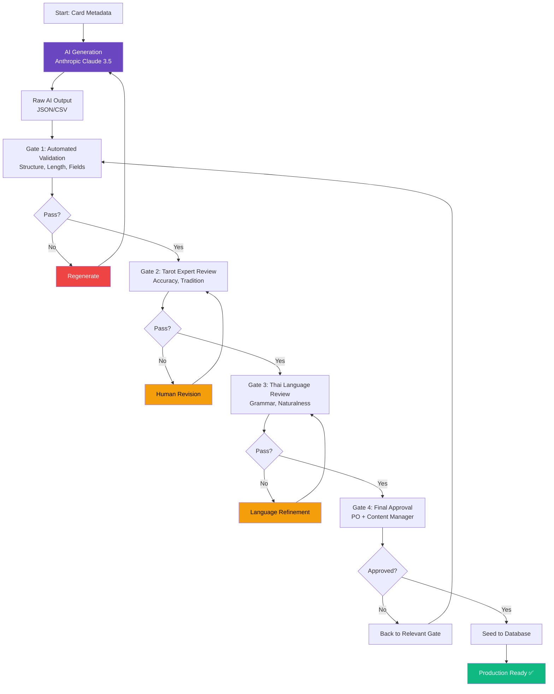

# Content Pipeline Architecture

This section defines the AI-powered content generation pipeline for creating 78 tarot card interpretations. The pipeline combines AI automation with human quality assurance to deliver accurate, culturally appropriate Thai-language content.

## Pipeline Overview



## Content Generation Architecture

**Tool Stack:**

| Component | Technology | Purpose |
|-----------|------------|---------|
| **AI Model** | Anthropic Claude 3.5 Sonnet | Content generation (superior Thai) |
| **Generation Script** | TypeScript (Node.js) | Orchestrate batch generation |
| **Validation** | Zod + Custom Scripts | Automated quality checks |
| **Review Tools** | Google Sheets (CSV export) | Human review interface |
| **Storage** | JSON files + Git | Version control for content |
| **Database Import** | Prisma seed script | Import to PostgreSQL |

**Script Organization:**

```
scripts/
├── content/
│   ├── generate-tarot-content.ts     # Main generation script
│   ├── prompts/
│   │   ├── system-prompt.ts          # Tarot expert persona
│   │   ├── card-prompt-template.ts   # Per-card prompt template
│   │   └── few-shot-examples.ts      # Example outputs for consistency
│   ├── validators/
│   │   ├── structure-validator.ts    # Gate 1 automated checks
│   │   ├── content-validator.ts      # Field validation
│   │   └── thai-text-validator.ts    # Language checks
│   ├── exporters/
│   │   ├── csv-exporter.ts           # Export for Google Sheets
│   │   └── json-exporter.ts          # Database-ready format
│   └── batch-processor.ts            # Handle rate limits, retries

content/
├── metadata/
│   └── cards-metadata.json           # 78 cards base info (suit, number, name)
├── generated/
│   └── raw-ai-output.json            # Unreviewed AI generation
├── reviewed/
│   ├── gate1-validated.json          # Passed automated checks
│   ├── gate2-tarot-reviewed.csv      # Expert review sheet
│   ├── gate3-thai-reviewed.csv       # Proofreading sheet
│   └── gate4-approved.json           # Final approved version
└── production/
    └── tarot-cards-final.json        # Production seed data
```

## Generation Prompt Architecture

**System Prompt (Tarot Expert Persona):**

```typescript
const SYSTEM_PROMPT = `
You are a professional tarot expert with 20+ years of experience writing tarot card interpretations in Thai language. You write for Thai audiences who are interested in spiritual guidance and self-reflection.

Your writing style:
- Warm, empathetic, and supportive (not scary or negative)
- Conversational Thai (ไม่เป็นทางการเกินไป)
- Accessible to beginners but meaningful for experienced readers
- Culturally appropriate for Thai context
- Practical advice grounded in real-life situations

Guidelines:
- Upright meanings focus on positive aspects and opportunities
- Reversed meanings suggest challenges and lessons (not doom)
- Keep paragraphs short (2-3 sentences each)
- Use everyday Thai vocabulary, avoid overly complex terms
- Include relatable examples (work, relationships, personal growth)
- Maintain mystical but approachable tone
- Align with traditional Rider-Waite interpretations

Output format:
- meaning_upright: 2-3 paragraphs (150-250 words in Thai)
- meaning_reversed: 2-3 paragraphs (150-250 words in Thai)
- keywords_upright: 4-6 keywords in Thai (ความสำเร็จ, โอกาสใหม่, etc.)
- keywords_reversed: 4-6 keywords in Thai (อุปสรรค, ความท้าทาย, etc.)
- advice: 1-2 paragraphs (100-150 words in Thai)
`;
```

**Per-Card Prompt Template:**

```typescript
function generateCardPrompt(card: CardMetadata): string {
  return `
Generate complete Thai tarot interpretation for:

**Card:** ${card.name} (${card.name_th})
**Suit:** ${card.suit}
**Number:** ${card.number}
**Arcana:** ${card.arcana}
${card.element ? `**Element:** ${card.element}` : ''}

Please provide:
1. **meaning_upright** (Thai, 2-3 paragraphs):
   - What this card represents when upright
   - Common situations where this card appears
   - Positive aspects and opportunities
   
2. **meaning_reversed** (Thai, 2-3 paragraphs):
   - What this card represents when reversed
   - Challenges or lessons to learn
   - How to work with this energy
   
3. **keywords_upright** (Thai, 4-6 keywords):
   - Key concepts for upright position
   
4. **keywords_reversed** (Thai, 4-6 keywords):
   - Key concepts for reversed position
   
5. **advice** (Thai, 1-2 paragraphs):
   - Practical guidance for daily life
   - How to apply this card's wisdom

Format as JSON:
{
  "meaning_upright": "...",
  "meaning_reversed": "...",
  "keywords_upright": ["...", "..."],
  "keywords_reversed": ["...", "..."],
  "advice": "..."
}
`;
}
```

## Batch Processing Strategy

**Rate Limit Management:**

```typescript
// scripts/content/batch-processor.ts
interface BatchConfig {
  batchSize: number;      // 10 cards per batch
  delayBetweenBatches: number;  // 15 seconds
  maxRetries: number;     // 3 retries per card
  retryDelay: number;     // Exponential backoff
}

export class ContentBatchProcessor {
  private config: BatchConfig = {
    batchSize: 10,
    delayBetweenBatches: 15000,  // Stay under 50 RPM limit
    maxRetries: 3,
    retryDelay: 1000,
  };

  async processBatch(cards: CardMetadata[]): Promise<GeneratedCard[]> {
    const results: GeneratedCard[] = [];
    
    // Process in batches of 10
    for (let i = 0; i < cards.length; i += this.config.batchSize) {
      const batch = cards.slice(i, i + this.config.batchSize);
      
      console.log(`Processing batch ${Math.floor(i / 10) + 1}/${Math.ceil(cards.length / 10)}`);
      
      // Parallel processing within batch
      const batchResults = await Promise.allSettled(
        batch.map(card => this.generateWithRetry(card))
      );
      
      // Handle results and failures
      batchResults.forEach((result, index) => {
        if (result.status === 'fulfilled') {
          results.push(result.value);
        } else {
          console.error(`Failed to generate ${batch[index].name}:`, result.reason);
          // Log failure for manual intervention
        }
      });
      
      // Wait between batches to respect rate limits
      if (i + this.config.batchSize < cards.length) {
        await this.delay(this.config.delayBetweenBatches);
      }
      
      // Progress update
      console.log(`Progress: ${Math.min(i + 10, cards.length)}/78 cards`);
    }
    
    return results;
  }

  private async generateWithRetry(
    card: CardMetadata,
    attempt = 0
  ): Promise<GeneratedCard> {
    try {
      return await generateCardContent(card);
    } catch (error) {
      if (attempt < this.config.maxRetries) {
        const delay = this.config.retryDelay * Math.pow(2, attempt);
        await this.delay(delay);
        return this.generateWithRetry(card, attempt + 1);
      }
      throw error;
    }
  }

  private delay(ms: number): Promise<void> {
    return new Promise(resolve => setTimeout(resolve, ms));
  }
}
```

**Execution Time Estimates:**

| Phase | Duration | Details |
|-------|----------|---------|
| **Batch Processing** | ~30 minutes | 78 cards ÷ 10 per batch × 15s delay + API time |
| **Gate 1 (Automated)** | ~2 minutes | Run validation scripts |
| **Gate 2 (Expert Review)** | 4-6 hours | Tarot expert reviews 78 cards |
| **Gate 3 (Proofreading)** | 3-4 hours | Thai language proofreader |
| **Gate 4 (Final Approval)** | 1 hour | PO + Content Manager review |
| **Total** | **1-2 days** | With parallel expert + proofreading |

## Content Storage & Version Control

**Storage Strategy:**

```typescript
// Content versioning structure
interface ContentVersion {
  version: string;           // v1.0, v1.1, etc.
  generated_at: string;      // ISO timestamp
  generated_by: 'ai' | 'human';
  ai_model?: string;         // claude-3-5-sonnet-20241022
  reviewer?: string;         // Name of human reviewer
  status: 'draft' | 'reviewed' | 'approved' | 'production';
  changes?: string[];        // List of changes from previous version
}

interface CardContent {
  card_id: string;
  name: string;
  name_th: string;
  meaning_upright: string;
  meaning_reversed: string;
  keywords_upright: string[];
  keywords_reversed: string[];
  advice: string;
  metadata: ContentVersion;
}
```

**Git Workflow:**

```bash
# 1. Generate content (feature branch)
git checkout -b content/tarot-cards-generation
pnpm generate:tarot-content
git add content/generated/
git commit -m "feat: Generate 78 tarot card interpretations (AI)"

# 2. Export for review
pnpm export:content-review
# → Generates CSV files for Google Sheets

# 3. After Gate 2-3 reviews, import revised content
git add content/reviewed/
git commit -m "review: Tarot expert and Thai proofreading complete"

# 4. After Gate 4 approval
git add content/production/
git commit -m "approve: Final content approval for production"

# 5. Seed to database
pnpm prisma:seed --source content/production/tarot-cards-final.json
git commit -m "chore: Seed approved tarot content to database"

# 6. Merge to main
git push origin content/tarot-cards-generation
# → Create PR with full review trail
# → Merge after final approval
```

## Integration with Quality Gates

**Automated Validation (Gate 1):**

```typescript
// scripts/content/validators/gate1-automated.ts
import { z } from 'zod';

const CardContentSchema = z.object({
  name: z.string().min(1),
  name_th: z.string().min(1),
  meaning_upright: z.string().min(100).max(500),
  meaning_reversed: z.string().min(100).max(500),
  keywords_upright: z.array(z.string()).min(4).max(6),
  keywords_reversed: z.array(z.string()).min(4).max(6),
  advice: z.string().min(80).max(300),
});

export async function validateGate1(cards: any[]): Promise<ValidationResult> {
  const results = {
    passed: 0,
    failed: 0,
    errors: [] as ValidationError[],
  };

  for (const card of cards) {
    try {
      CardContentSchema.parse(card);
      
      // Additional checks
      if (containsProfanity(card.meaning_upright)) {
        throw new Error('Contains inappropriate language');
      }
      
      if (!isValidThaiText(card.name_th)) {
        throw new Error('Invalid Thai characters');
      }
      
      results.passed++;
    } catch (error) {
      results.failed++;
      results.errors.push({
        card: card.name,
        error: error.message,
      });
    }
  }

  return results;
}
```

**Review Export (Gates 2-3):**

```typescript
// scripts/content/exporters/csv-exporter.ts
export function exportForReview(cards: GeneratedCard[]): string {
  const headers = [
    'Card Number',
    'Name (EN)',
    'Name (TH)',
    'Meaning Upright',
    'Meaning Reversed',
    'Keywords Up',
    'Keywords Rev',
    'Advice',
    'Reviewer Notes',
    'Status (Pass/Fail)',
    'Required Changes',
  ];

  const rows = cards.map(card => [
    card.number,
    card.name,
    card.name_th,
    card.meaning_upright,
    card.meaning_reversed,
    card.keywords_upright.join(', '),
    card.keywords_reversed.join(', '),
    card.advice,
    '', // Reviewer fills
    '', // Reviewer fills
    '', // Reviewer fills
  ]);

  return [headers, ...rows]
    .map(row => row.map(cell => `"${cell}"`).join(','))
    .join('\n');
}
```

## Content Update & Maintenance

**Post-Launch Content Updates:**

```typescript
// Future: Content improvement pipeline
interface ContentUpdateRequest {
  card_id: string;
  field: 'meaning_upright' | 'meaning_reversed' | 'advice';
  reason: string;
  proposed_change: string;
  requested_by: string;
}

// Workflow:
// 1. User feedback → Content update request
// 2. Content team reviews
// 3. If approved → Re-run relevant quality gates
// 4. Deploy update
// 5. Notify users (optional, for major changes)
```

**Content Analytics:**

```typescript
// Track content performance
interface ContentMetrics {
  card_id: string;
  views: number;              // How often viewed
  avg_time_on_page: number;   // Engagement indicator
  bounce_rate: number;        // Quality indicator
  feedback_score: number;     // User ratings (future)
  share_count: number;        // Virality indicator
}

// Identify improvement opportunities
// Cards with high bounce rate or low time-on-page may need content refinement
```

## Content Generation Cost Breakdown

**Anthropic API Pricing (Claude 3.5 Sonnet):**
- Input: $3.00 per million tokens
- Output: $15.00 per million tokens

**Cost Calculation:**

| Item | Tokens | Cost (USD) | Cost (THB) |
|------|--------|------------|------------|
| **System prompt** (78 requests) | 78 × 500 = 39K | $0.12 | ~฿4 |
| **Input prompts** (78 cards) | 78 × 300 = 23.4K | $0.07 | ~฿2 |
| **Output** (78 cards) | 78 × 1,500 = 117K | $1.76 | ~฿60 |
| **Regenerations** (~10% failure) | 10K input + 15K output | $0.26 | ~฿9 |
| **Total API Cost** | ~194K tokens | **$2.21** | **~฿75** |

**Total Budget Including Human Review:**

| Item | Cost (THB) |
|------|------------|
| Anthropic API | ฿75 |
| Tarot Expert Review (6 hours @ ฿1,000/hr) | ฿6,000 |
| Thai Proofreader (4 hours @ ฿800/hr) | ฿3,200 |
| Content Manager (2 hours @ ฿1,200/hr) | ฿2,400 |
| **Total** | **~฿11,675** |

**One-time investment for 78 professional tarot card contents** ✅

## Pipeline Performance

**Generation Speed:**
- Single card: ~8-12 seconds (API call + processing)
- Batch of 10: ~2 minutes (parallel processing)
- All 78 cards: ~25-30 minutes (with rate limit delays)

**Quality Gate Duration:**
- Gate 1 (Automated): 2-5 minutes
- Gate 2 (Expert): 4-6 hours
- Gate 3 (Proofreading): 3-4 hours
- Gate 4 (Approval): 1 hour

**Total Pipeline Time:** 1-2 business days (with parallel reviews)

---
