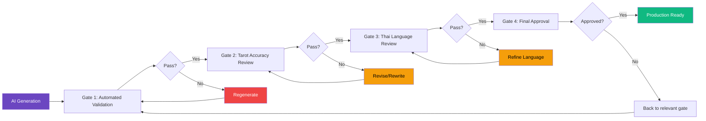
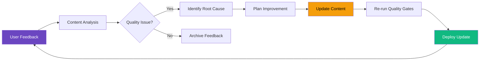

# Content Quality Assurance Strategy

## Overview

**Context:** 78 tarot cards content generated using AI (Anthropic Claude 3.5 Sonnet) with mandatory human verification before production deployment.

**Quality Philosophy:** AI accelerates content creation, humans ensure accuracy and cultural appropriateness. Zero tolerance for inaccurate or inappropriate content in production.

**Timeline:** 5 days (content generation + review + approval)

**Budget:** ฿7,500-11,700 (API costs ฿30-75 + expert review ฿3,000-6,000 + proofreading ฿2,000-3,200)

---

## Content Generation Process

**Tool:** Anthropic Claude API (Claude 3.5 Sonnet)
- Superior Thai language capabilities
- Context-aware content generation
- Cost-effective (~฿32 for 78 cards)

**Generation Pipeline:**

```bash
# 1. Generate all 78 cards
pnpm generate:tarot-content

# 2. Export for human review
pnpm export:content-review --format csv,json

# 3. After review, import approved content
pnpm prisma:seed --source content/reviewed-cards.json
```

**Output Formats:**
- CSV: Human-readable review format (Google Sheets compatible)
- JSON: Database-ready format (Prisma import)

---

## Quality Gate Framework (4-Stage Process)



---

## Gate 1: Automated Validation ✅

**Responsibility:** QA Team (Automated Scripts)

**Purpose:** Ensure AI output meets technical specifications before human review

**Validation Criteria:**

```typescript
// tests/content/automated-validation.test.ts

describe('Content Automated Validation', () => {
  describe('Structural Validation', () => {
    test('All 78 cards generated successfully', async () => {
      const cards = await loadGeneratedCards();
      expect(cards).toHaveLength(78);
    });

    test('All required fields present', async () => {
      const cards = await loadGeneratedCards();
      cards.forEach(card => {
        expect(card.name).toBeTruthy();
        expect(card.name_th).toBeTruthy();
        expect(card.meaning_upright).toBeTruthy();
        expect(card.meaning_reversed).toBeTruthy();
        expect(card.keywords_upright).toBeInstanceOf(Array);
        expect(card.keywords_reversed).toBeInstanceOf(Array);
        expect(card.advice).toBeTruthy();
      });
    });
  });

  describe('Content Length Validation', () => {
    test('Meaning fields within length constraints', async () => {
      const cards = await loadGeneratedCards();
      cards.forEach(card => {
        // Min 200 words, max 1000 words
        expect(card.meaning_upright.length).toBeGreaterThan(200);
        expect(card.meaning_upright.length).toBeLessThan(1000);
        expect(card.meaning_reversed.length).toBeGreaterThan(200);
        expect(card.meaning_reversed.length).toBeLessThan(1000);
        
        // Advice: 100-500 words
        expect(card.advice.length).toBeGreaterThan(100);
        expect(card.advice.length).toBeLessThan(500);
      });
    });

    test('Keywords array length valid', async () => {
      const cards = await loadGeneratedCards();
      cards.forEach(card => {
        expect(card.keywords_upright.length).toBeGreaterThanOrEqual(5);
        expect(card.keywords_upright.length).toBeLessThanOrEqual(10);
        expect(card.keywords_reversed.length).toBeGreaterThanOrEqual(5);
        expect(card.keywords_reversed.length).toBeLessThanOrEqual(10);
      });
    });
  });

  describe('Language Detection', () => {
    test('Thai language detected in content', async () => {
      const cards = await loadGeneratedCards();
      cards.forEach(card => {
        expect(isThaiText(card.name_th)).toBe(true);
        expect(isThaiText(card.meaning_upright)).toBe(true);
        expect(isThaiText(card.meaning_reversed)).toBe(true);
        expect(containsThaiCharacters(card.advice)).toBe(true);
      });
    });

    test('No English-only content in Thai fields', async () => {
      const cards = await loadGeneratedCards();
      cards.forEach(card => {
        expect(isEnglishOnly(card.meaning_upright)).toBe(false);
        expect(isEnglishOnly(card.meaning_reversed)).toBe(false);
      });
    });
  });

  describe('Content Safety', () => {
    test('No profanity or inappropriate content', async () => {
      const cards = await loadGeneratedCards();
      cards.forEach(card => {
        expect(containsProfanity(card.meaning_upright)).toBe(false);
        expect(containsProfanity(card.meaning_reversed)).toBe(false);
        expect(containsProfanity(card.advice)).toBe(false);
      });
    });

    test('No overly negative or scary language', async () => {
      const cards = await loadGeneratedCards();
      const negativeWords = ['โชคร้าย', 'อันตราย', 'หายนะ', 'ตาย'];
      cards.forEach(card => {
        negativeWords.forEach(word => {
          expect(card.meaning_upright).not.toContain(word);
          expect(card.advice).not.toContain(word);
        });
      });
    });
  });

  describe('Data Integrity', () => {
    test('Unique card IDs', async () => {
      const cards = await loadGeneratedCards();
      const ids = cards.map(c => c.id);
      const uniqueIds = new Set(ids);
      expect(uniqueIds.size).toBe(cards.length);
    });

    test('Valid suit and number combinations', async () => {
      const cards = await loadGeneratedCards();
      cards.forEach(card => {
        if (card.suit === 'major_arcana') {
          expect(card.number).toBeGreaterThanOrEqual(0);
          expect(card.number).toBeLessThanOrEqual(21);
          expect(card.element).toBeNull();
        } else {
          expect(card.number).toBeGreaterThanOrEqual(1);
          expect(card.number).toBeLessThanOrEqual(14);
          expect(card.element).toBeTruthy();
        }
      });
    });
  });
});
```

**Pass Criteria:**
- ✅ 100% test pass rate (all assertions pass)
- ✅ Zero empty fields
- ✅ Thai language detected in all Thai fields
- ✅ Length constraints met
- ✅ No content safety violations

**Action on Failure:**
- Re-generate failed cards automatically
- Maximum 3 retry attempts
- Escalate to manual review if still failing

---

## Gate 2: Tarot Accuracy Review 🔮

**Responsibility:** External Tarot Expert

**Purpose:** Verify content accuracy against traditional Rider-Waite tarot interpretations

**Review Checklist:**

```yaml
Tarot Accuracy Review Checklist:

Per Card (78 total):
  Content Accuracy:
    - [ ] Meaning aligns with Rider-Waite tradition
    - [ ] Upright interpretation accurate
    - [ ] Reversed interpretation distinct and accurate
    - [ ] Keywords reflect traditional symbolism
    - [ ] No contradictions with established meanings
  
  Interpretation Quality:
    - [ ] Advice is appropriate for card meaning
    - [ ] Context-appropriate guidance
    - [ ] Balanced perspective (not overly positive/negative)
    - [ ] Practical and actionable advice
  
  Consistency:
    - [ ] Consistent with related cards in same suit
    - [ ] Major Arcana progression makes sense
    - [ ] Court cards hierarchy appropriate
  
  Rating: [1-5 stars]
  Issues: [List any concerns]
  Recommendation: [Approve / Revise / Reject]
```

**Review Process:**

1. **Sample Review First (10 cards):**
   - Review diverse sample (2 Major, 2 from each Minor suit)
   - Assess overall quality and approach
   - Decide: Continue with all 78 or regenerate

2. **Full Review (if sample passes):**
   - Review all 78 cards systematically
   - Flag issues in review spreadsheet
   - Provide specific revision guidance

3. **Revision Round:**
   - Re-generate or manually edit problematic cards
   - Expert re-reviews revised cards
   - Iterate until approval

**Pass Criteria:**
- ✅ Average rating: ≥4.5/5 stars
- ✅ Approval rate: ≥95% (max 4 cards need revision)
- ✅ Zero major inaccuracies
- ✅ Expert sign-off documented

**Timeline:** 1-2 days (2-3 hours expert time)

**Cost:** ฿3,000-5,000 (freelance tarot expert)

**Action on Failure:**
- Individual card regeneration (AI)
- Manual writing for persistently problematic cards
- Expert consultation on prompt refinement

---

## Gate 3: Thai Language Quality Review 🇹🇭

**Responsibility:** Native Thai Speaker (Proofreader)

**Purpose:** Ensure natural, grammatically correct, and culturally appropriate Thai language

**Review Checklist:**

```yaml
Thai Language Quality Checklist:

Per Card:
  Grammar & Structure:
    - [ ] No grammatical errors
    - [ ] Natural sentence flow
    - [ ] Appropriate word choices
    - [ ] No literal translation artifacts
    - [ ] Punctuation correct
  
  Tone & Style:
    - [ ] Warm and encouraging tone
    - [ ] Conversational yet professional
    - [ ] Appropriate for target audience (25-40 years)
    - [ ] Consistent voice across cards
    - [ ] No overly formal/archaic language
  
  Cultural Appropriateness:
    - [ ] Culturally sensitive content
    - [ ] Thai idioms used correctly (if any)
    - [ ] No inappropriate cultural references
    - [ ] Respectful spiritual language
  
  Readability:
    - [ ] Easy to understand
    - [ ] Clear and concise
    - [ ] No ambiguous phrasing
    - [ ] Mobile-friendly (short paragraphs)
  
  Rating: [1-5 stars]
  Issues: [List specific errors/suggestions]
  Recommendation: [Approve / Minor edits / Major revision]
```

**Review Process:**

1. **Grammar & Syntax Check:**
   - Use automated tools (LanguageTool for Thai)
   - Manual review by native speaker
   - Fix obvious errors

2. **Naturalness Assessment:**
   - Read aloud test (does it sound natural?)
   - Compare with human-written tarot content
   - Flag translation-like phrases

3. **Cultural Review:**
   - Verify appropriate spiritual terminology
   - Check for unintentionally offensive content
   - Ensure brand tone alignment

**Pass Criteria:**
- ✅ Average rating: ≥4.5/5 stars
- ✅ Zero grammatical errors
- ✅ ≥90% "natural Thai" rating
- ✅ Brand tone alignment: ≥4/5 stars
- ✅ Proofreader sign-off documented

**Timeline:** 1-2 days (4-6 hours proofreading time)

**Cost:** ฿2,000-3,000 (฿25-40 per card)

**Action on Failure:**
- Minor edits: Direct correction by proofreader
- Major revision: Re-generate with refined prompts
- Persistent issues: Manual rewriting

---

## Gate 4: Final Product Approval ✅

**Responsibility:** Product Manager (John) + QA Lead (Quinn)

**Purpose:** Final verification before production deployment

**Approval Checklist:**

```yaml
Final Approval Checklist:

Technical Verification:
  - [ ] All 78 cards passed Gate 1-3
  - [ ] Database import successful (dev environment)
  - [ ] API returns content correctly
  - [ ] Frontend displays content properly
  - [ ] No performance issues (page load <1s)
  - [ ] Thai fonts rendering correctly

Content Quality:
  - [ ] Random sample review (10 cards) by PM
  - [ ] Consistent tone across all cards
  - [ ] No obvious errors or issues
  - [ ] Advice is actionable and appropriate
  - [ ] Brand voice alignment verified

Business Validation:
  - [ ] Timeline met (5 days)
  - [ ] Budget within limits (≤฿10,000)
  - [ ] Expert reviews documented
  - [ ] Quality gates evidence archived
  - [ ] Risk mitigation successful

Legal & Compliance:
  - [ ] Content reviewed disclaimer added
  - [ ] Expert credentials documented
  - [ ] No copyright violations
  - [ ] PDPA compliance (no PII in content)

Sign-offs:
  - [ ] Tarot Expert: _______________ Date: _______
  - [ ] Thai Proofreader: ___________ Date: _______
  - [ ] QA Lead (Quinn): ___________ Date: _______
  - [ ] PM (John): _________________ Date: _______
```

**Final Validation:**

```bash
# Run complete test suite
pnpm test:content

# Manual spot checks
pnpm test:content:manual --random 10

# Performance validation
pnpm lighthouse:check --target=reading-results

# Deploy to staging
pnpm deploy:staging

# Smoke tests on staging
pnpm test:e2e:staging
```

**Pass Criteria:**
- ✅ All checklist items completed
- ✅ All stakeholders signed off
- ✅ Zero P0/P1 bugs found
- ✅ Staging environment fully functional

**Timeline:** 4-6 hours (final testing + approvals)

**Action on Failure:**
- Return to relevant quality gate
- Document blockers and resolution plan
- Re-run approval process after fixes

---

## Risk Assessment & Mitigation

**Risk Matrix:**

| Risk | Probability | Impact | Mitigation Strategy | Owner |
|------|------------|--------|---------------------|-------|
| **AI generates inaccurate meanings** | Medium | Critical | Gate 2: Tarot expert review | QA |
| **Thai language unnatural/incorrect** | Medium | High | Gate 3: Native speaker review | QA |
| **Brand tone mismatch** | Low | Medium | Sample testing + refinement | PM |
| **Content too generic** | Low | Medium | Prompt engineering + expert review | Architect |
| **Timeline overrun (>5 days)** | Low | Medium | Parallel review process | PM |
| **Budget overrun (>฿10K)** | Low | Low | Fixed-price contracts with experts | PM |
| **Expert unavailable** | Low | High | Backup reviewers pre-identified | PM |
| **API rate limits hit** | Low | Low | Implement delays, use paid tier | Architect |

**Mitigation Actions:**

1. **Pre-identify backup reviewers** (both tarot expert and proofreader)
2. **Pilot test with 10 cards** before full generation
3. **Daily progress tracking** during review period
4. **Escalation protocol** for quality issues
5. **Rollback plan** if production issues discovered

---

## Content Quality Metrics

**Quantitative Metrics:**

```yaml
Success Metrics:
  Completeness:
    - 78/78 cards generated: 100%
    - All required fields populated: 100%
    - No empty content: 0 occurrences
  
  Efficiency:
    - Generation time: <20 minutes
    - Review time: 2-3 days
    - Total time: ≤5 days
    - Budget: ≤฿10,000
  
  Quality:
    - Automated validation pass rate: 100%
    - Expert approval rate: ≥95%
    - Language quality rating: ≥4.5/5
    - Revision rate: ≤10%
  
  Production:
    - Zero P0 bugs post-deployment
    - Page load time: <1s (with content)
    - User complaints: <1% of readings
```

**Qualitative Metrics:**

```yaml
User Feedback (Post-Launch):
  - Content feels personal: ≥4/5 stars
  - Advice is helpful: ≥4/5 stars
  - Easy to understand: ≥4.5/5 stars
  - Appropriate tone: ≥4.5/5 stars
  
Expert Assessment:
  - Tarot accuracy: ≥4.5/5 stars
  - Thai language quality: ≥4.5/5 stars
  - Brand alignment: ≥4/5 stars
```

---

## Documentation & Audit Trail

**Required Documentation:**

```
docs/content-quality/
├── generation-log.md              # Generation process log
├── automated-validation-results.json  # Gate 1 results
├── tarot-expert-review.csv        # Gate 2 review sheet
├── thai-proofreading-review.csv   # Gate 3 review sheet
├── final-approval-checklist.pdf   # Gate 4 sign-offs
├── revision-history.md            # All revisions made
└── expert-credentials.pdf         # Reviewer qualifications

output/
├── tarot-cards-generated.json     # Original AI output
├── tarot-cards-reviewed.json      # Post-review version
└── tarot-cards-approved.json      # Production-ready version
```

**Version Control:**

```bash
# All content changes tracked in git
git log --follow content/tarot-cards.json

# Review comments in PR
GitHub PR #123: Content Quality Review - 78 Tarot Cards
├─ Gate 1: Automated checks ✅
├─ Gate 2: Tarot expert review ✅
├─ Gate 3: Thai proofreading ✅
└─ Gate 4: Final approval ✅
```

---

## Post-Deployment Monitoring

**Ongoing Quality Checks:**

```yaml
Week 1-2 Post-Launch:
  - Monitor user feedback (support tickets, reviews)
  - Track bounce rates on reading result pages
  - Analyze time-on-page for interpretations
  - Collect qualitative feedback via surveys
  
Month 1:
  - Review analytics: which cards most/least viewed
  - Identify content improvement opportunities
  - Plan content refinement iteration (if needed)
  
Quarterly:
  - Content quality audit (sample 20 cards)
  - Update content based on user feedback
  - Refine based on new tarot insights
```

**Success Criteria (Post-Launch):**

- ✅ <1% user complaints about content accuracy
- ✅ Reading completion rate ≥80%
- ✅ Average time-on-page ≥2 minutes (indicating engagement)
- ✅ No viral negative feedback on social media
- ✅ Expert community feedback positive

---

## Continuous Improvement

**Feedback Loop:**



**Content Update Policy:**

- **Minor updates** (typos, grammar): Direct fix → Quick review → Deploy
- **Major updates** (meaning changes): Full quality gate process
- **Quarterly reviews**: Systematic improvement of 10-15 cards
- **Emergency fixes**: Fast-track process for critical inaccuracies

---
