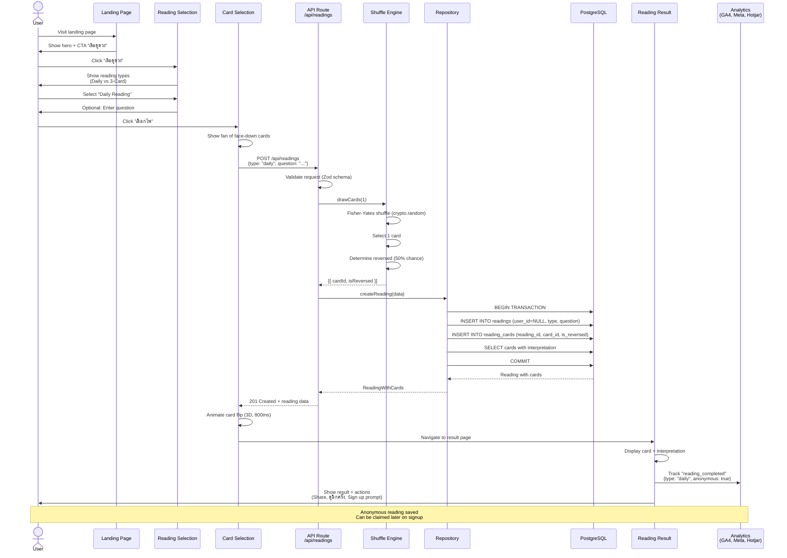
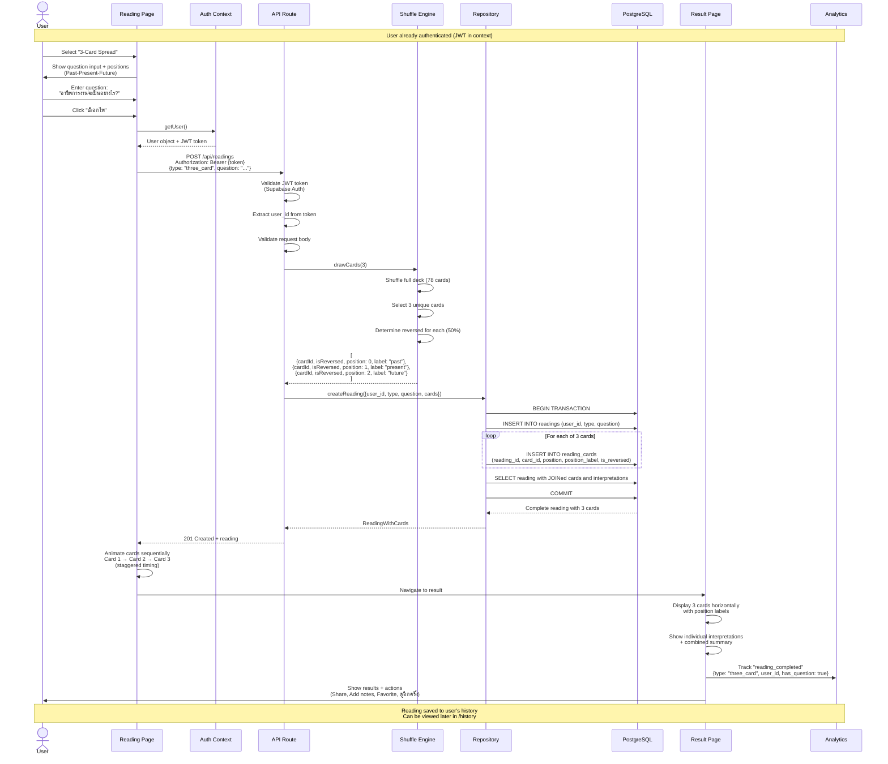
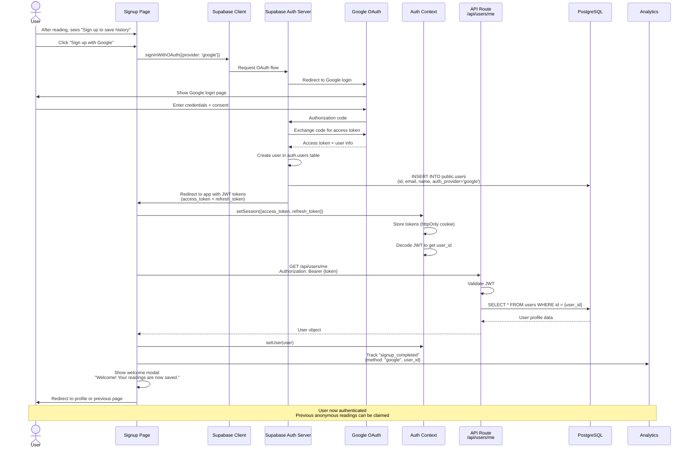

# Core Workflows

This section illustrates critical system workflows using sequence diagrams. These workflows represent the most important user journeys and system interactions, clarifying architecture decisions and complex interactions between components.

## Workflow 1: Daily Reading (Anonymous User)

**User Journey:** First-time visitor performs a daily reading without creating an account.

**Key Points:**
- No authentication required (frictionless UX per PRD)
- Card shuffle uses cryptographically secure randomization
- Reading saved with `user_id = NULL` for anonymous users
- Transaction ensures data consistency
- Analytics tracked at completion
- Signup prompt shown (conversion opportunity)

---

## Workflow 2: 3-Card Spread (Authenticated User)

**User Journey:** Returning logged-in user performs a 3-card spread with a specific question.

**Key Points:**
- JWT authentication required (Bearer token)
- User context available throughout flow
- 3 cards drawn sequentially with position labels
- Transaction ensures all 3 cards saved atomically
- Personalized result display (user-specific)
- Richer actions available (notes, favorite)

---

## Workflow 3: User Signup & Login (OAuth - Google)

**User Journey:** New user signs up using Google OAuth after completing an anonymous reading.

**Key Points:**
- OAuth flow handled by Supabase (no manual token exchange)
- User record automatically created in public.users table
- JWT tokens stored securely (httpOnly cookies recommended)
- Auth context provides user state to entire app
- Welcome experience for new users
- Analytics track signup method

---

## Workflow Summary

| Workflow | Complexity | Authentication | Key Components | PRD Epic |
|----------|------------|----------------|----------------|----------|
| **Daily Reading (Anonymous)** | Medium | ❌ None | Shuffle Engine, Repository, Analytics | Epic 1 |
| **3-Card Spread (Auth)** | High | ✅ JWT | Shuffle Engine, Repository, Position Logic | Epic 1, 2 |
| **Signup/Login (OAuth)** | High | ✅ Supabase Auth | OAuth Flow, Auth Context, User Creation | Epic 2 |

**Total Workflows Documented:** 3 critical user journeys  
**Coverage:** Epic 1 + Epic 2 core flows  
**Format:** Mermaid sequence diagrams (interactive in supported viewers)

---
