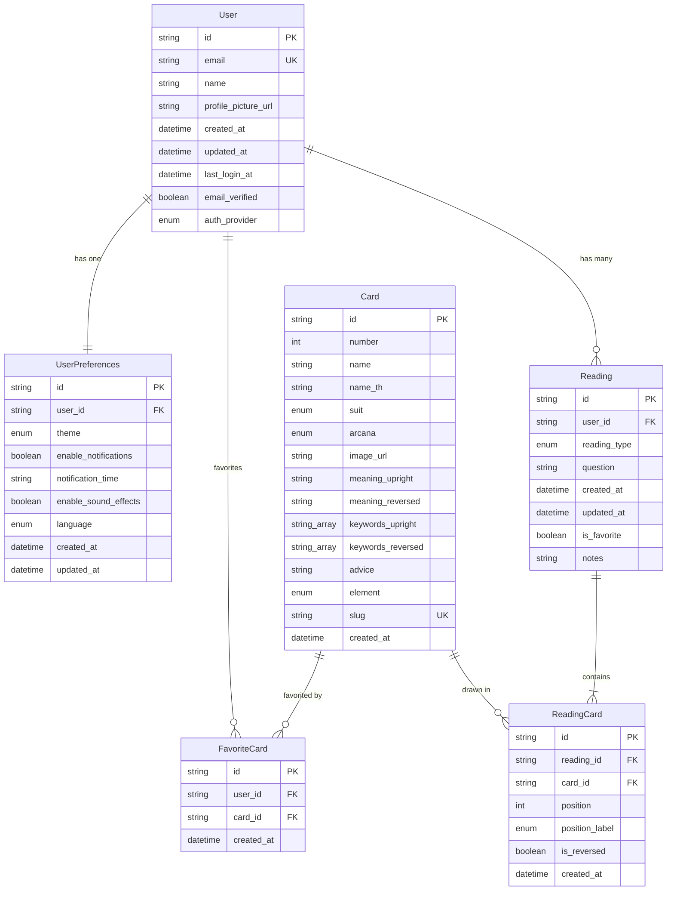

# Data Model Relationships Diagram

```mermaid
erDiagram
    User ||--o{ Reading : "has many"
    User ||--o{ FavoriteCard : "favorites"
    User ||--|| UserPreferences : "has one"
    
    Reading ||--|{ ReadingCard : "contains"
    Card ||--o{ ReadingCard : "drawn in"
    Card ||--o{ FavoriteCard : "favorited by"
    
    User {
        string id PK
        string email UK
        string name
        string profile_picture_url
        datetime created_at
        datetime updated_at
        datetime last_login_at
        boolean email_verified
        enum auth_provider
    }
    
    Card {
        string id PK
        int number
        string name
        string name_th
        enum suit
        enum arcana
        string image_url
        string meaning_upright
        string meaning_reversed
        string_array keywords_upright
        string_array keywords_reversed
        string advice
        enum element
        string slug UK
        datetime created_at
    }
    
    Reading {
        string id PK
        string user_id FK
        enum reading_type
        string question
        datetime created_at
        datetime updated_at
        boolean is_favorite
        string notes
    }
    
    ReadingCard {
        string id PK
        string reading_id FK
        string card_id FK
        int position
        enum position_label
        boolean is_reversed
        datetime created_at
    }
    
    FavoriteCard {
        string id PK
        string user_id FK
        string card_id FK
        datetime created_at
    }
    
    UserPreferences {
        string id PK
        string user_id FK
        enum theme
        boolean enable_notifications
        string notification_time
        boolean enable_sound_effects
        enum language
        datetime created_at
        datetime updated_at
    }
```

---
