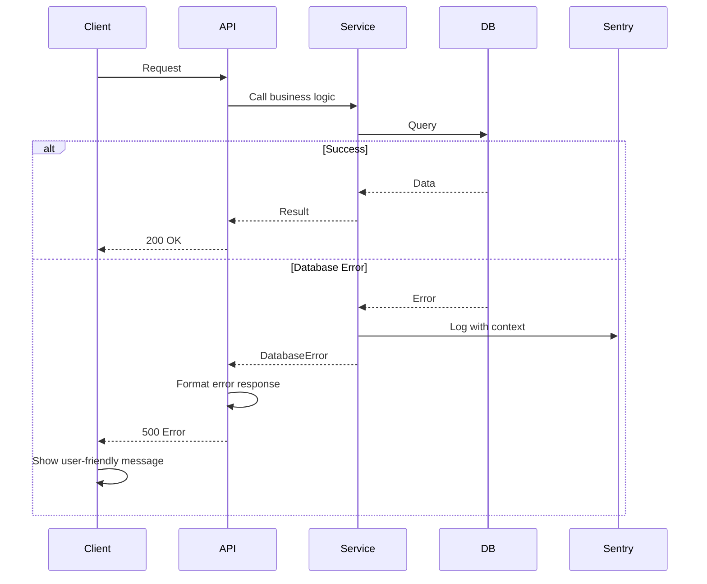

# Error Handling Strategy

## Error Flow



## Error Response Format

```typescript
interface ApiError {
  error: {
    code: string;           // ERROR_CODE
    message: string;        // User-friendly message (Thai)
    details?: Record<string, any>;  // Additional context
    timestamp: string;      // ISO 8601
    requestId: string;      // For tracing
  };
}
```

## Frontend Error Handling

```typescript
// lib/api/client.ts
export async function apiCall<T>(endpoint: string, options?: ApiOptions): Promise<T> {
  try {
    const response = await fetch(`/api${endpoint}`, {
      method: options?.method || 'GET',
      headers: { 'Content-Type': 'application/json', ...options?.headers },
      body: options?.body ? JSON.stringify(options.body) : undefined,
    });

    if (!response.ok) {
      const error = await response.json();
      throw new ApiError(error);
    }

    return response.json();
  } catch (error) {
    if (error instanceof ApiError) {
      // Log to Sentry with user context
      Sentry.captureException(error, {
        tags: { endpoint, method: options?.method || 'GET' },
      });
      
      // Show user-friendly message
      showToast({
        title: 'เกิดข้อผิดพลาด',
        message: error.message,
        type: 'error',
      });
      
      throw error;
    }
    
    // Network error
    throw new Error('ไม่สามารถเชื่อมต่อได้ กรุณาลองใหม่อีกครั้ง');
  }
}
```

## Backend Error Handling

```typescript
// app/api/middleware/error.ts
export function handleApiError(error: unknown): NextResponse {
  // Log to Sentry
  Sentry.captureException(error);

  // Database errors
  if (error instanceof Prisma.PrismaClientKnownRequestError) {
    if (error.code === 'P2002') {
      return NextResponse.json(
        { error: { code: 'DUPLICATE_ENTRY', message: 'ข้อมูลซ้ำ' } },
        { status: 409 }
      );
    }
    // ... other Prisma errors
  }

  // Validation errors (Zod)
  if (error instanceof z.ZodError) {
    return NextResponse.json(
      { 
        error: { 
          code: 'VALIDATION_ERROR', 
          message: 'ข้อมูลไม่ถูกต้อง',
          details: error.errors 
        } 
      },
      { status: 400 }
    );
  }

  // Authentication errors
  if (error.message === 'Authentication required') {
    return NextResponse.json(
      { error: { code: 'UNAUTHORIZED', message: 'กรุณาเข้าสู่ระบบ' } },
      { status: 401 }
    );
  }

  // Generic error
  return NextResponse.json(
    { error: { code: 'INTERNAL_ERROR', message: 'เกิดข้อผิดพลาด กรุณาลองใหม่' } },
    { status: 500 }
  );
}
```

---
