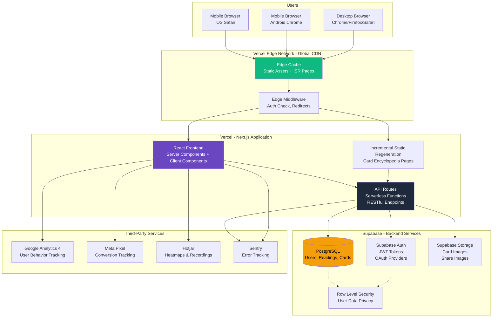

# High Level Architecture

## Technical Summary

The Web App ดูดวงไพ่ยิปซี follows a **modern Jamstack architecture with serverless backend**, deployed entirely on Vercel's edge network with Supabase as the managed backend-as-a-service (BaaS). The frontend leverages **Next.js 14+ App Router** with React Server Components for optimal performance and SEO, while the backend utilizes **Next.js API Routes** as serverless functions providing RESTful APIs. **Supabase** serves as the unified backend platform, providing PostgreSQL database, authentication (JWT-based), file storage (S3-compatible), and real-time capabilities. The entire stack is deployed to **Vercel**, enabling automatic scaling, edge caching, and sub-second global response times. This architecture achieves the PRD's core goals: <1s page load times, SEO optimization through SSR, mobile-first progressive web app capabilities, and a development experience optimized for rapid iteration and AI-driven development.

## Platform and Infrastructure Choice

Based on the PRD requirements for rapid MVP development, excellent SEO, mobile-first PWA capabilities, and budget constraints (<$50/month), we evaluated several options:

**Options Considered:**

1. **Vercel + Supabase** (Recommended ✅)
   - **Pros:** Zero-config Next.js deployment, excellent DX, generous free tiers, automatic edge caching, built-in analytics
   - **Cons:** Vendor lock-in (mitigated by standard tech stack), Supabase EU region may have slight latency for Thailand users
   - **Cost:** $0-20/month for MVP (both have generous free tiers)

2. **AWS Full Stack** (Lambda + API Gateway + RDS + Cognito + S3)
   - **Pros:** Maximum flexibility, Thailand region available, enterprise-grade
   - **Cons:** Complex setup, higher operational overhead, steeper learning curve, higher costs ($50-100/month minimum)
   - **Cost:** $50-150/month

3. **Google Cloud** (Cloud Run + Cloud SQL + Firebase Auth)
   - **Pros:** Good for ML/AI (future features), Thailand region available
   - **Cons:** More complex than Vercel, higher costs, less integrated DX
   - **Cost:** $40-80/month

**Decision: Vercel + Supabase** ✅

**Rationale:**
- **Perfect fit for Next.js 14 App Router** - Vercel built Next.js, zero-config deployment
- **Free tier covers MVP** - Vercel: 100GB bandwidth, Supabase: 50K MAU, 500MB database
- **Fastest time-to-market** - Managed services reduce DevOps overhead by ~80%
- **Excellent SEO & Performance** - Edge network, automatic image optimization, ISR support
- **AI-friendly architecture** - Simple, well-documented APIs that AI agents can work with easily

**Platform:** Vercel + Supabase  
**Key Services:**
- **Vercel:** Edge Network, Serverless Functions, Analytics, Web Vitals Monitoring
- **Supabase:** PostgreSQL Database, Authentication (JWT), Storage (S3-compatible), Row Level Security (RLS)
- **Vercel CDN:** Global edge caching for static assets and ISR pages
- **Additional Services:** Sentry (error tracking), Google Analytics 4, Meta Pixel, Hotjar

**Deployment Host and Regions:**
- **Frontend (Vercel):** Global Edge Network (300+ locations worldwide including Asia-Pacific)
- **Database (Supabase):** Singapore region (closest to Thailand, ~50-80ms latency)
- **CDN:** Vercel Edge Network with automatic geo-routing

## Repository Structure

**Structure:** Monorepo with pnpm workspaces  
**Monorepo Tool:** pnpm workspaces (native, no additional tool needed)  
**Package Organization:** Apps + Shared Packages pattern

**Rationale:**
- **Monorepo benefits for this project:**
  - Share TypeScript types between frontend and backend (type-safe API contracts)
  - Shared utilities (card shuffle logic, constants, validators)
  - Unified dependency management and build process
  - Simplified for AI agents - everything in one repository

- **pnpm workspaces over Turborepo/Nx:**
  - **Simpler for MVP** - No additional configuration or learning curve
  - **Sufficient for project size** - 1 Next.js app with shared packages
  - **Faster installs** - pnpm's efficient node_modules structure
  - **Can migrate to Turborepo later** if project grows to multiple apps

**Package Strategy:**
```
/
├── apps/
│   └── web/                 # Main Next.js application (frontend + API routes)
├── packages/
│   ├── shared/              # Shared types, constants, utilities
│   ├── ui/                  # Shared UI components (future: admin dashboard)
│   └── config/              # Shared configs (ESLint, TypeScript, Tailwind)
└── package.json             # Root workspace configuration
```

**Why single app for MVP:**
- PRD specifies web app only (no separate mobile app or admin dashboard in MVP)
- Backend is serverless functions within Next.js (no separate backend service)
- Future-ready: Can add `apps/admin/` or `apps/mobile/` when needed

## High Level Architecture Diagram



## Architectural Patterns

The following architectural patterns guide both frontend and backend development:

- **Jamstack Architecture:** Static site generation with serverless APIs and edge caching for optimal performance and scalability - _Rationale:_ Perfect fit for content-heavy tarot encyclopedia with dynamic reading features; enables <1s load times and excellent SEO through pre-rendering.

- **Serverless Functions (FaaS):** Next.js API Routes deployed as Vercel serverless functions - _Rationale:_ Zero infrastructure management, automatic scaling, pay-per-execution pricing ideal for MVP with unpredictable traffic; eliminates DevOps complexity for AI-driven development.

- **Backend-as-a-Service (BaaS):** Supabase provides managed database, auth, and storage - _Rationale:_ Reduces backend development time by 60-70%, includes production-ready auth and security (RLS) out-of-the-box, allows team to focus on business logic.

- **Component-Based UI:** Reusable React components with TypeScript for type safety - _Rationale:_ Maintainability and consistency across 7+ screens; enables parallel development by AI agents; type safety prevents runtime errors during rapid iteration.

- **Server Components + Client Components (React 18):** Use Server Components by default, Client Components only when needed for interactivity - _Rationale:_ Reduces JavaScript bundle size by ~40%, improves Time to Interactive (TTI), automatic code splitting by Next.js App Router.

- **Repository Pattern:** Abstract database access through repository layer - _Rationale:_ Decouples business logic from database implementation, makes unit testing easier, enables future migration from Supabase if needed (though unlikely).

- **Row Level Security (RLS):** Postgres RLS policies enforce data access at database level - _Rationale:_ Defense in depth - even if API security is bypassed, database enforces authorization; Supabase makes RLS policies easy to implement and maintain.

- **Incremental Static Regeneration (ISR):** Pre-render pages at build time, revalidate in background - _Rationale:_ Encyclopedia pages (78 cards) benefit from static generation for SEO and performance, ISR allows content updates without full rebuilds.

- **Progressive Web App (PWA):** Service worker for offline capability and installability - _Rationale:_ PRD requirement for home screen installation, offline access to tarot guide improves UX for returning users, increases engagement through push notifications.

- **Mobile-First Responsive Design:** Design for mobile viewport first, enhance for larger screens - _Rationale:_ PRD specifies 80% mobile traffic, thumb-friendly UI with ≥44px touch targets, one-hand usability prioritized.

- **API Gateway Pattern:** Single entry point through Next.js API Routes with centralized error handling and auth - _Rationale:_ Simplified client code, consistent error responses, centralized logging and monitoring, easy to add rate limiting or caching middleware.

---
