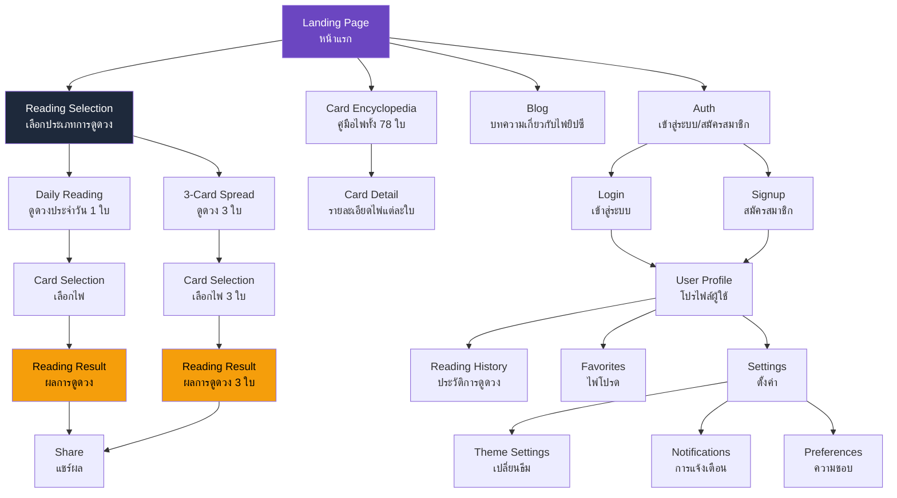
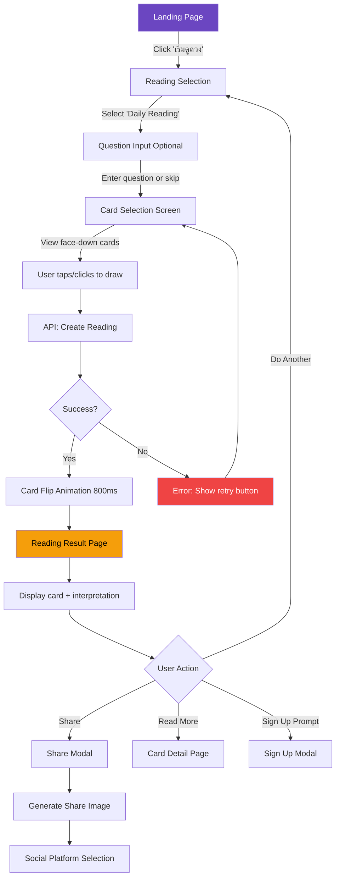
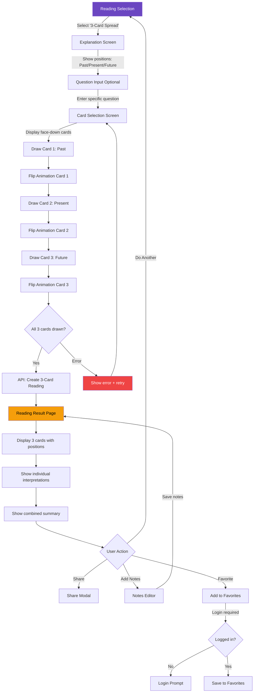
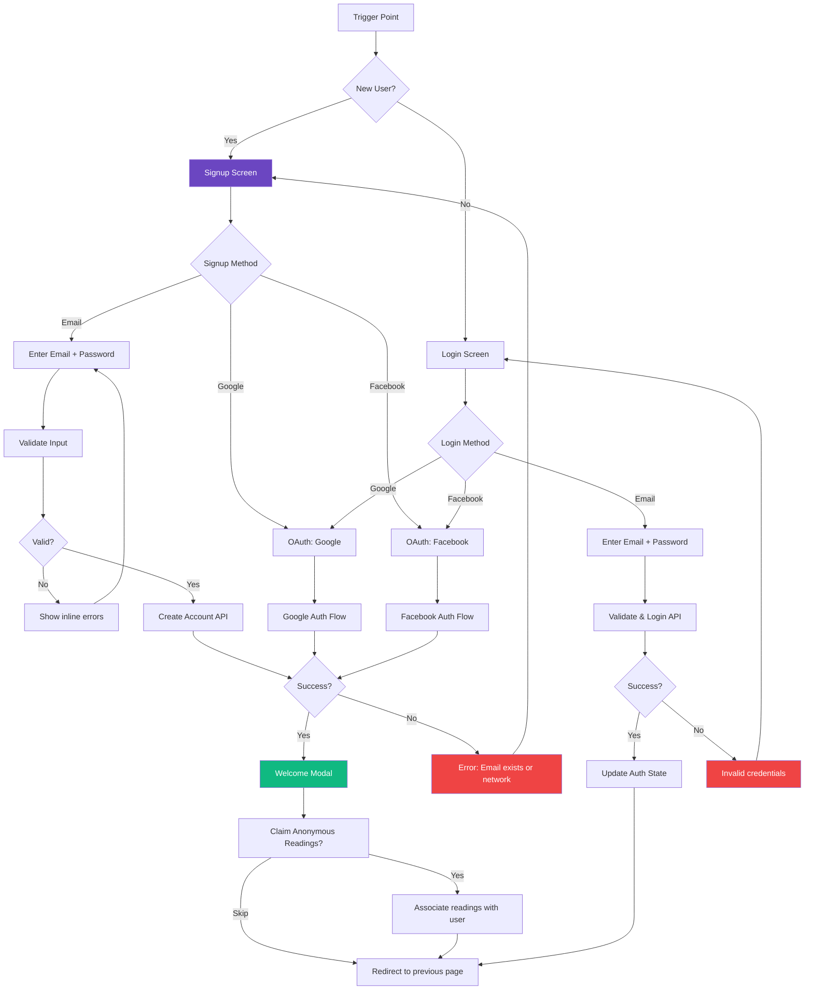

# Web App ดูดวงไพ่ยิปซี UI/UX Specification

## Introduction

This document defines the user experience goals, information architecture, user flows, and visual design specifications for Web App ดูดวงไพ่ยิปซี's user interface. It serves as the foundation for visual design and frontend development, ensuring a cohesive and user-centered experience.

### Overall UX Goals & Principles

#### Target User Personas

1. **ผู้ใช้ที่ชอบดูดวงเป็นประจำ (Regular Seeker)**
   - ใช้ดูดวงเป็นเครื่องมือตัดสินใจในชีวิตประจำวัน
   - ต้องการความแม่นยำและลึกซึ้ง
   - คาดหวัง personalization และการบันทึกประวัติ

2. **คนทำงานที่เครียด (Stressed Professional)**
   - ต้องการคำตอบหรือความสบายใจเร็วๆ
   - ใช้เวลาน้อย ต้องการ UI ที่ใช้งานง่ายทันที
   - เข้าถึงผ่านมือถือเป็นหลัก (80%)

#### Usability Goals

- **Instant Gratification:** ผู้ใช้ใหม่สามารถดูดวงครั้งแรกได้ภายใน 30 วินาที (ไม่ต้องสมัครสมาชิก)
- **Speed:** หน้าเว็บโหลดภายใน 1 วินาที (First Contentful Paint < 1s)
- **Intuitive Selection:** การเลือกไพ่ต้องรู้สึกเหมือนใช้สัญชาตญาณ ไม่ใช่แค่กดปุ่ม
- **Emotional Connection:** สร้างความรู้สึก intimate, mystical และ calming
- **Mobile-First:** ทุก interaction ต้องทำงานได้ดีด้วยนิ้วมือเดียว (one-hand use)

#### Design Principles

1. **Mystical yet Modern** - รักษาบรรยากาศลึกลับแบบ spiritual แต่ใช้งานง่ายแบบแอปยุคใหม่
2. **Immediate Feedback** - ทุก action มี response ทันที (animation, haptic, visual feedback)
3. **Progressive Disclosure** - เริ่มจากง่าย แล้วค่อยเปิดเผยฟีเจอร์ advanced ตามความพร้อม
4. **Emotional Design** - ใช้ color, typography, animation สร้างความรู้สึกอบอุ่นและปลอดภัย
5. **Accessibility-First** - WCAG AA compliance ตั้งแต่เริ่มต้น ไม่ใช่เพิ่มทีหลัง

#### Change Log

| Date | Version | Description | Author |
|------|---------|-------------|--------|
| 2025-12-30 | 0.1 | Initial UI/UX Specification | Sally (UX Expert) |

---

## Information Architecture (IA)

### Site Map / Screen Inventory

### Navigation Structure

**Primary Navigation:** แสดงทุกหน้าผ่าน Header bar

- **Desktop/Tablet:**
  - Logo/App Name (คลิกกลับ Home)
  - "ดูดวง" → Reading Selection
  - "คู่มือไพ่" → Card Encyclopedia
  - "บล็อก" → Blog (Epic 3)
  - User Menu (Profile icon หรือ Login/Signup buttons)
    - Logged in: Profile, History, Favorites, Settings, Logout
    - Anonymous: Login, Sign up

- **Mobile (≤768px):**
  - Hamburger menu icon (ซ้ายบน)
  - Logo/App Name (กลาง)
  - User icon (ขวาบน)
  - เมื่อเปิด hamburger: Full-screen menu overlay

**Secondary Navigation:**

- **Reading Flow:** Visual progress indicator
  - Step 1: เลือกประเภท
  - Step 2: เลือกไพ่
  - Step 3: ดูผล
  
- **Card Encyclopedia:** Filter และ Search controls
  - Filter by: Major Arcana, Wands, Cups, Swords, Pentacles
  - Sort by: Name, Suit, Number
  - Search bar

- **Profile Section:** Tab navigation
  - History | Favorites | Settings

**Breadcrumb Strategy:** ใช้สำหรับ deep pages เท่านั้น

- รูปแบบ: หน้าแรก > คู่มือไพ่ > The Fool
- Mobile: Back button พร้อม label "กลับ" หรือชื่อหน้าก่อนหน้า
- ไม่แสดงใน reading flow (ใช้ progress indicator แทน)

---

## User Flows

### Flow 1: Daily Reading (Anonymous User)

**User Goal:** ดูดวงประจำวันแบบรวดเร็วเพื่อรับ insight สำหรับวันนี้

**Entry Points:** 
- Landing page → "เริ่มดูดวง" button
- Direct URL: `/reading/daily`
- Navigation menu → "ดูดวง" → "ดูดวงประจำวัน"

**Success Criteria:**
- ผู้ใช้ได้รับผลการดูดวงภายใน 30 วินาที
- Animation ทำงานได้ smooth (60fps)
- ผลการดูดวงแสดงชัดเจนและเข้าใจง่าย

#### Flow Diagram

#### Edge Cases & Error Handling:

- **Network timeout:** แสดง loading skeleton > 3 วินาที แล้วแสดง "กำลังโหลด..." ถ้าเกิน 10 วินาที แสดง error พร้อม retry
- **API error:** แสดงข้อความ "เกิดข้อผิดพลาด กรุณาลองอีกครั้ง" พร้อมปุ่ม "ลองอีกครั้ง"
- **Animation stutter:** Fallback เป็น simple fade ถ้าเครื่องช้า (detect via performance.now())
- **Back button during animation:** ยกเลิก animation และกลับไปหน้าก่อน
- **Multiple clicks:** Disable button หลัง click แรกจนกว่าจะโหลดเสร็จ

**Notes:** Animation duration critical: 800ms รู้สึก magical พอแต่ไม่นานเกินไป. Haptic feedback บน mobile เพิ่ม tactile satisfaction. Signup prompt แสดงหลังดูครั้งที่ 2-3.

---

### Flow 2: 3-Card Spread (Past-Present-Future)

**User Goal:** ได้รับ insight เชิงลึกเกี่ยวกับสถานการณ์ผ่านมุมมอง 3 มิติ (อดีต-ปัจจุบัน-อนาคต)

**Entry Points:**
- Reading Selection → "ไพ่ 3 ใบ"
- Direct URL: `/reading/three-card`

**Success Criteria:**
- ผู้ใช้เข้าใจความหมายของแต่ละตำแหน่ง (Past/Present/Future)
- การ์ด 3 ใบแสดงผลพร้อมกัน readable บน mobile
- Summary section ผสมผสาน insight ทั้ง 3 ใบได้อย่างสอดคล้อง

#### Flow Diagram

#### Edge Cases & Error Handling:

- **Card drawing interruption:** ถ้า user กด back ระหว่างดึงการ์ด → แสดง confirm dialog "ต้องการยกเลิกการดูดวงหรือไม่?"
- **Slow connection:** แสดง progress (Card 1/3, 2/3, 3/3) ระหว่างรอ
- **Mobile landscape:** Layout เปลี่ยนเป็น horizontal card display
- **Long question text:** Truncate ที่ 500 chars พร้อม character counter
- **Same card drawn twice:** Technically impossible (shuffle ensures unique) แต่ fallback ให้ re-shuffle

**Notes:** Staggered animation (Card 1 → Card 2 → Card 3) สร้าง anticipation. Desktop: แสดง 3 การ์ดเรียงข้างกัน, Mobile: แสดงแนวตั้งเพื่อ readability.

---

### Flow 3: User Signup & Login

**User Goal:** สร้างบัญชีเพื่อบันทึกประวัติและเข้าถึงฟีเจอร์เพิ่มเติม

**Entry Points:**
- Signup prompt หลังดูดวง 2-3 ครั้ง
- Navigation menu → "เข้าสู่ระบบ"
- "Favorite" button (ต้อง login)
- Reading History (ต้อง login)

**Success Criteria:**
- Signup สำเร็จภายใน 1 นาที
- Social login (Google/Facebook) ทำงานได้ smooth
- Previous anonymous readings ถูก "claim" ได้

#### Flow Diagram

#### Edge Cases & Error Handling:

- **Email already exists:** แสดง "อีเมลนี้ถูกใช้แล้ว ต้องการเข้าสู่ระบบหรือไม่?" พร้อมลิงก์ login
- **Weak password:** Real-time validation พร้อม strength indicator
- **OAuth popup blocked:** แสดงคำแนะนำให้ allow popups
- **OAuth cancelled:** กลับไปหน้า signup/login ไม่แสดง error
- **Network error during signup:** บันทึก form data ใน localStorage แล้วให้ retry
- **Forgot password:** Link ไปหน้า password reset พร้อม email input

**Notes:** Social login ควรอยู่ด้านบน (easier/faster). Email signup ด้านล่างพร้อม divider "หรือ". PDPA consent checkbox required สำหรับ email signup.

---

## Wireframes & Mockups

**Primary Design Files:** Figma (recommended) - `[Link to be added after Figma project creation]`

**Note:** This section provides low-fidelity conceptual layouts for key screens. High-fidelity designs will be created in Figma based on these concepts.

### Key Screen Layouts

#### Screen 1: Landing Page (Homepage)

**Purpose:** แสดง value proposition ชัดเจนภายใน 3 วินาที, สร้าง mystical first impression, ชักจูงให้ user เริ่มดูดวงทันที

**Key Elements:**
- Hero section พร้อม headline และ call-to-action
- Animated floating cards (3 cards with gentle rotation)
- Social proof (user count, ratings)
- Feature highlights (Daily Reading, 3-Card Spread, Encyclopedia)
- Navigation header (logo, menu, user icon)

**Interaction Notes:** Hero CTA มี subtle glow animation (pulsing gold). Floating cards มี gentle rotation และ parallax effect. Mobile: CTA button ใช้ 80% screen width. Desktop: Centered layout max-width 1200px.

**Design File Reference:** `Figma → Pages → Landing → Frame: Landing-Desktop-v1`

---

#### Screen 2: Reading Type Selection

**Purpose:** ให้ user เลือกระหว่าง Daily Reading และ 3-Card Spread พร้อมอธิบายความแตกต่างชัดเจน

**Key Elements:**
- Two large interactive cards (Daily Reading, 3-Card Spread)
- Card preview images
- Time estimates (⏱️ 1-2 min vs 3-5 min)
- Difficulty indicators (⭐ beginner vs ⭐⭐ intermediate)
- Brief descriptions
- Primary CTA buttons ("เริ่มดูดวง")

**Interaction Notes:** Cards เป็น interactive buttons ทั้งแผ่น. Hover: lift effect + shadow. Mobile: cards stack vertically. Include "ไม่แน่ใจ? อ่านข้อแนะนำ" helper link.

**Design File Reference:** `Figma → Pages → Reading-Flow → Frame: Selection-v1`

---

#### Screen 3: Card Selection Screen

**Purpose:** ให้ user "เลือก" ไพ่ด้วยสัญชาตญาณ, สร้าง mystical experience

**Key Elements:**
- Progress indicator (• ○ ○)
- Optional question input (floating label, 500 char limit)
- Face-down cards in fan/arc layout (9-12 cards visible)
- Swipe/drag controls (← Swipe to browse →)
- Selected card highlight (golden ring)
- Primary CTA: "เลือกไพ่นี้" button

**Interaction Notes:** Cards จัดวางเป็น fan layout. Drag/swipe ซ้าย-ขวา. Hover: lift + subtle glow. Haptic feedback เมื่อ select (mobile). Optional shuffle animation (2s).

**Design File Reference:** `Figma → Pages → Reading-Flow → Frame: Card-Selection-v2`

---

#### Screen 4: Reading Result Screen

**Purpose:** แสดงผลการดูดวงอย่างชัดเจนและสวยงาม, สร้าง emotional impact

**Key Elements:**
- Large card image (primary focal point)
- Card name (Thai + English)
- Upright/Reversed indicator
- Interpretation sections:
  - 💫 ความหมาย (Meaning)
  - 🎯 คำแนะนำ (Advice)
- Action buttons: ❤️ Favorite, 📝 Add Notes, 🔄 ดูอีกครั้ง
- Share button (top-right)
- Signup prompt (for anonymous users)

**Interaction Notes:** Card flip animation (800ms) on entry. Sticky card image เมื่อ scroll (mini version). Desktop: 2-column layout. Mobile: single column, card บนสุด. Share → modal. Favorite → heart animation + toast.

**Design File Reference:** `Figma → Pages → Reading-Flow → Frame: Result-Daily-v3`

**3-Card Spread Variant:** Three cards displayed horizontally (desktop) or vertically (mobile) with position labels (อดีต/ปัจจุบัน/อนาคต). Combined summary section connecting all three cards.

**Design File Reference:** `Figma → Pages → Reading-Flow → Frame: Result-3Card-v2`

---

#### Screen 5-7: Additional Screens

**Screen 5: User Profile/History** - Timeline view of past readings, favorites collection, settings tabs  
**Screen 6: Card Encyclopedia** - Grid layout of 78 cards, filter/search controls, card detail pages  
**Screen 7: Onboarding Tutorial** - Tooltip-based walkthrough (3-4 steps, skippable)

_These screens will be detailed in subsequent design iterations._

---

## Component Library / Design System

**Design System Approach:** Custom Design System built on **Headless UI + Tailwind CSS**

**Rationale:** ไม่ใช้ existing design systems (Material, Chakra) เพราะ mystical aesthetic เป็นเอกลักษณ์เฉพาะ. Headless UI ให้ accessible primitives. Tailwind CSS เป็น design token system และ utility-first approach. Component-driven architecture สร้างเป็น reusable React components พร้อม TypeScript types.

### Core Components

#### 1. Button Component

**Purpose:** Primary interactive element สำหรับ actions ทั้งหมด

**Variants:** primary (gold gradient), secondary (transparent border), ghost (no background), danger (red accent)

**States:** default, hover (scale 1.05 + glow), active, disabled, loading

**Usage Guidelines:** Min touch target 44×44px, padding 16px 32px (lg), border radius 12px, transition 0.2s ease-in-out, focus ring 2px gold

---

#### 2. Card Display Component

**Purpose:** แสดงไพ่ยิปซีในทุก context

**Variants:** face-down, face-up, reversed, thumbnail

**States:** default, hover (lift + glow), selected (golden ring), flipping (800ms 3D), loading

**Usage Guidelines:** Aspect ratio 2:3, sizes sm/md/lg, shadow with purple tint, WebP images with lazy loading

---

#### 3. Modal Component

**Purpose:** Overlays สำหรับ secondary content

**Variants:** default (centered), fullscreen (mobile), drawer (slide from bottom)

**States:** open, closed, opening (200ms fade), closing (150ms fade)

**Usage Guidelines:** Backdrop blur, max-width 600px, focus trap, ESC key closes

---

#### 4. Input Component

**Purpose:** Text input สำหรับ forms

**Variants:** text, textarea, search, password

**States:** default, focus (gold border + glow), error (red + message), disabled, filled (floating label)

**Usage Guidelines:** Height 48px, font-size 16px (prevent iOS zoom), floating label animation 150ms

---

#### 5. Progress Indicator

**Purpose:** แสดง progress ใน reading flow

**Variants:** dots (• ○ ○), bar (0-100%), steps (labeled)

**States:** current (filled + highlighted), completed (filled + muted), upcoming (outlined)

**Usage Guidelines:** Visible on all reading flow screens, updates in real-time

---

#### 6. Toast Notification

**Purpose:** Feedback messages (success/error/info/warning)

**Variants:** success (green + checkmark), error (red + X), info (blue + i), warning (orange + !)

**States:** entering (slide from top 200ms), visible (auto-dismiss 4s), exiting (150ms)

**Usage Guidelines:** Max 1 toast at a time, stacking for multiple messages

---

#### 7. Card Fan Layout

**Purpose:** แสดงไพ่เรียงเป็น fan/arc

**Variants:** full-arc (180° desktop), partial-arc (120° mobile), horizontal (fallback)

**States:** browsing (swipeable), selecting (one highlighted), selected (others fade)

**Usage Guidelines:** Arc angle responsive, 8px overlap, GPU-accelerated transforms

---

#### 8. Loading Skeleton

**Purpose:** Placeholder ระหว่าง loading

**Variants:** card, text, avatar, custom

**States:** loading (pulsing shimmer effect)

**Usage Guidelines:** Match component dimensions, pulsing animation 1.5s infinite

---

## Branding & Style Guide

**Brand Guidelines:** Mystical/Spiritual Aesthetic with Dark Mode Focus (ตาม PRD Section "Branding")

**Brand Personality:** Mystical (ลึกลับ ศักดิ์สิทธิ์), Modern (ทันสมัย ใช้งานง่าย), Welcoming (อบอุ่น ให้กำลังใจ), Sophisticated (มีระดับ premium แต่ accessible)

**Mood Reference:** เหมือนการเข้า cozy bookshop ที่มีหนังสือเก่าแก่และเทียนไข - คลาสสิคแต่ไม่ล้าสมัย อบอุ่นแต่ลึกลับ

### Color Palette

| Color Type | Hex Code | Usage |
|------------|----------|-------|
| **Primary** | #6B46C1 | Mystical, spiritual - hero sections, primary buttons, important highlights |
| **Secondary** | #1E293B | Calm, trust - backgrounds, cards, secondary UI elements |
| **Accent** | #F59E0B | Luxury, enlightenment - CTAs, highlights, gold glow effects |
| **Background** | #0F172A | Sophisticated dark mode - main background |
| **Text Primary** | #F1F5F9 | Soft white - main readable text, headings |
| **Text Secondary** | #94A3B8 | Muted text - descriptions, secondary info |
| **Success** | #10B981 | Positive feedback, confirmations |
| **Warning** | #F59E0B | Cautions, important notices |
| **Error** | #EF4444 | Errors, destructive actions |
| **Border** | rgba(241, 245, 249, 0.1) | Subtle borders, dividers |

**Color Guidelines:** 60-30-10 rule, all text meets WCAG AA contrast (4.5:1 for normal, 3:1 for large), gradients for mystical effects

### Typography

#### Font Families

- **Primary (Headings):** Playfair Display, serif - Elegant, mystical feel (weights: 400, 600, 700)
- **Secondary (Body):** Inter, sans-serif - Modern, highly readable (weights: 400, 500, 600)
- **Mystical Accent:** Pinyon Script, cursive - Calligraphy style, accent only (weight: 400)

#### Type Scale

| Element | Size | Weight | Line Height | Usage |
|---------|------|--------|-------------|-------|
| **H1** | 48px (3rem) | 700 | 1.2 (56px) | Page titles, hero headlines |
| **H2** | 36px (2.25rem) | 600 | 1.3 (48px) | Section headers |
| **H3** | 28px (1.75rem) | 600 | 1.4 (40px) | Subsection headers, card names |
| **Body** | 16px (1rem) | 400 | 1.6 (24px) | Main body text, descriptions |
| **Small** | 14px (0.875rem) | 400 | 1.5 (20px) | Captions, helper text |

**Responsive Typography:** Mobile (< 768px) ลด font sizes 20%, Tablet ลด 10%, Desktop full scale

### Iconography

**Icon Library:** Lucide React v0.309+

**Usage Guidelines:**
- Sizes: 16px (inline), 24px (buttons), 32px (features), 48px (heroes)
- Stroke width: 2px consistent
- Color: Inherit from parent
- Hover: scale 1.1 + color shift

**Common Icons:** Sparkles (magic), Heart (favorite), FileText (notes), RotateCw (refresh), User, Settings, Search, Check, X

### Spacing & Layout

**Grid System:** 12-column responsive grid (Tailwind CSS)
- Desktop: 12 columns, 24px gutter, max-width 1280px
- Tablet: 8 columns, 20px gutter
- Mobile: 4 columns, 16px gutter, 16px margins

**Spacing Scale:** Base 4px - xs(4), sm(8), md(16), lg(24), xl(32), 2xl(48), 3xl(64), 4xl(96)

**Layout Patterns:** Card grids 24px gap, form fields 16px margin, sections 64px padding (desktop) / 32px (mobile)

---

## Accessibility Requirements

**Compliance Target:** WCAG 2.1 Level AA (Web Content Accessibility Guidelines)

**Target Date:** MVP launch (Epic 1) - accessibility is not an afterthought but core requirement

### Key Requirements

**Visual:**
- Color contrast ratios: ≥ 4.5:1 for normal text, ≥ 3:1 for large text (all combinations tested and passing)
- Focus indicators: 2px solid gold (#F59E0B) ring on ALL interactive elements, never removed
- Text sizing: Resizable up to 200% without loss of functionality, use rem/em units
- Color usage: Never color alone - always pair with text labels, icons, or patterns

**Interaction:**
- Keyboard navigation: ALL functionality available via keyboard (Tab, Shift+Tab, Enter, Space, Escape, Arrows)
- Screen reader support: Semantic HTML, proper heading hierarchy (H1 → H2 → H3), ARIA labels, live regions
- Touch targets: Minimum 44×44px with 8px spacing between targets
- Motion: Respect `prefers-reduced-motion` - disable animations for users who prefer reduced motion

**Content:**
- Alternative text: ALL images have descriptive alt text (decorative images use alt="")
- Heading structure: Logical hierarchy, one H1 per page, no skipped levels
- Form labels: ALL inputs have associated `<label>` elements, error messages use aria-describedby

### Testing Strategy

**Automated:** axe DevTools, Lighthouse (score ≥ 95), WAVE, Pa11y in CI/CD

**Manual:** Keyboard-only navigation, screen reader testing (VoiceOver/NVDA/JAWS), 200% zoom test, color blindness simulation

**Testing Checklist:** Alt text, contrast ratios, focus indicators, keyboard navigation, heading hierarchy, form labels, ARIA attributes, skip links, no keyboard traps, reduced motion support, touch target sizing

---

## Responsiveness Strategy

**Philosophy:** Mobile-first design (80% mobile traffic per PRD) - design for 320px first, then enhance for larger screens

### Breakpoints

| Breakpoint | Min Width | Max Width | Target Devices | Priority |
|------------|-----------|-----------|----------------|----------|
| **Mobile** | 320px | 767px | iPhone SE, smartphones | 🔴 Primary |
| **Tablet** | 768px | 1023px | iPad, Android tablets | 🟡 Secondary |
| **Desktop** | 1024px | 1279px | Laptops, small monitors | 🟢 Tertiary |
| **Wide** | 1280px | - | Large monitors, 4K | 🟢 Tertiary |

### Adaptation Patterns

**Layout Changes:**
- **Mobile:** Single column, full-width, stacked cards, vertical 3-card spread, sticky header, bottom sheet modals
- **Tablet:** 2-column grids, max-width 768px centered, horizontal 3-card spread possible, sidebar navigation
- **Desktop:** 3-4 column grids, max-width 1280px, side-by-side layouts, hover states, centered modals

**Navigation Changes:**
- **Mobile:** Hamburger menu (full-screen overlay), user icon dropdown, back button (not breadcrumb)
- **Tablet:** Transitional - may show full nav in header, tabs visible, search bar in header
- **Desktop:** Full navigation in header, hover menus, breadcrumbs, keyboard shortcuts

**Content Priority:**
- **Mobile:** Show essential only (card, main interpretation, primary CTA), collapse long descriptions, minimal footer
- **Tablet:** Show more sidebars, filters, related content
- **Desktop:** Show all content, multi-column layouts, advanced options

**Interaction Changes:**
- **Mobile:** Touch gestures (swipe, pull-to-refresh, long-press), haptic feedback, 44×44px targets, no hover, infinite scroll
- **Tablet:** Hybrid touch + mouse, keyboard optional, 40×40px targets
- **Desktop:** Mouse primary (hover effects, tooltips), keyboard shortcuts, 32×32px targets, pagination

**Typography Adaptation:**
- **Mobile:** H1 32px, H2 28px, H3 22px (20% smaller)
- **Tablet:** H1 40px, H2 32px, H3 24px (10% smaller)
- **Desktop:** H1 48px, H2 36px, H3 28px (full size)
- **Body text:** 16px all breakpoints (readability)

---

## Animation & Micro-interactions

**Motion Principles:** Meaningful motion (purposeful, not decorative), natural & organic (ease-in-out curves), performance-first (60fps, GPU-accelerated), respectful timing (150-1200ms range), accessible by default (respect prefers-reduced-motion)

### Key Animations

**1. Card Flip Animation** - Duration: 800ms, Easing: cubic-bezier(0.4, 0, 0.2, 1) (primary mystical moment)
- 3D flip (rotateY 0° → 180°), card face changes at 50%, subtle glow, optional particles, haptic feedback

**2. Card Hover/Selection** - Duration: 200ms, Easing: ease-out
- Lift 8px, glow shadow, scale 1.02, golden ring when selected

**3. Page Transitions** - Duration: 300ms, Easing: ease-in-out
- Fade out/in, optional vertical slide (20px)

**4. Button Press** - Duration: 150ms
- Scale 0.98, brightness decrease, ripple effect, haptic feedback

**5. Modal Open/Close** - Duration: 250ms (open), 200ms (close)
- Backdrop fade, modal scale + fade, blur backdrop

**6. Toast Notification** - Duration: 200ms in, 150ms out
- Slide from top, bounce on entry, auto-dismiss 3-4s

**7. Loading States** - Continuous
- Skeleton shimmer (1.5s loop), spinner rotation, progress bar, floating particles

**8. Card Fan Animation** - Duration: 600ms staggered
- Cards appear one by one, spread into fan, 50ms stagger, rotate per position

**9. Scroll Reveal** - Duration: 400ms
- Fade in + slide up (40px), trigger at 20% visible, once only

**10. Favorite Heart** - Duration: 500ms spring
- Fill color, scale bounce (1 → 1.3 → 1), particle burst, sound/haptic

**Animation Library:** Framer Motion v11.0+ (React-optimized, spring physics, gesture support)

**Performance Budget:** 60fps all animations, < 20KB bundle, GPU-accelerated (transform/opacity only), RAF for scroll

---

## Performance Considerations

### Performance Goals

- **Page Load:** FCP < 1s (4G mobile) - Landing < 800ms, Reading < 1s, Encyclopedia < 1.2s
- **Interaction Response:** FID < 100ms - Buttons < 50ms, Card selection < 100ms, Forms immediate
- **Animation FPS:** Consistent 60fps (16.67ms per frame) - Card flip, scroll, transitions all smooth

**Core Web Vitals Targets:**
- LCP < 1.5s
- FID < 100ms
- CLS < 0.1
- TTI < 2s
- TBT < 200ms
- Lighthouse ≥ 90 (mobile), ≥ 95 (desktop)

### Design Strategies

**Image Optimization:** WebP format (80-90% compression), lazy loading below-fold, responsive images per device, dimensions specified (prevent CLS), hero images priority, CDN via Vercel Edge, card images < 5MB total

**Code Splitting:** Route-based automatic (Next.js), lazy load heavy components, tree shaking, bundle < 200KB initial (gzipped)

**Critical CSS & Fonts:** Inline critical CSS, defer non-critical, next/font optimization, display: swap, subset Thai + English only

**Render Optimization:** React Server Components default, Client Components when needed, Streaming SSR, Suspense boundaries, Static Generation with ISR

**Caching:** Static assets immutable (1 year), card images long TTL, SWR for API, ISR revalidate 24h, Service Worker for PWA

**Animation Performance:** GPU-accelerated (transform/opacity only), RAF for scroll, will-change sparingly, simplify on low-end devices

**Third-Party Scripts:** Defer analytics (afterInteractive), async all scripts, self-host critical, load on interaction

**PWA:** Service Worker cache, offline encyclopedia, App Manifest, push notifications (Epic 4)

**Monitoring:** Vercel Analytics (Real-time Web Vitals), Lighthouse CI (automated), PageSpeed Insights (monthly), Sentry Performance, custom metrics

**Performance Budget:** Document 30KB, Script 200KB, Stylesheet 30KB, Images 500KB/page, Fonts 100KB, FCP < 1000ms, LCP < 1500ms, TTI < 2000ms

